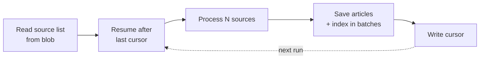

# Discovery Cadence

> How often discovery runs, how much it does per run, and how to change it.
> Companion to [system-design.md](system-design.md).

Sized against the source list on **20 August 2026**: 47,102 sources, 38,956 with a feed
and 8,146 without.

## Summary

| Setting                       | Deployed      | Code default    | Meaning                      |
| ----------------------------- | ------------- | --------------- | ---------------------------- |
| `BLOGME_DISCOVERY_SCHEDULE`   | `0 0 * * * *` | `0 0 */6 * * *` | Timer cron, hourly           |
| `BLOGME_DISCOVERY_BATCH`      | `1000`        | `200`           | Sources examined per run     |
| `BLOGME_MAX_POSTS_PER_SOURCE` | `30`          | `15`            | Newest posts read per source |

Both are Function App application settings, so changing cadence is a configuration change
and needs **no redeploy**. The deployed values override the code defaults in
[config.go](../api/config.go); the fallbacks apply only when a setting is absent.

## Why discovery is batched

One run cannot walk the whole list. The corpus is tens of thousands of sources, each
needing a robots.txt check, a feed or sitemap read, and a fetch per new post, while the
Functions host caps an invocation at **30 minutes**.

So each run takes a slice of the list and records the last source it handled. The next run
resumes after it and wraps around at the end, giving every source regular coverage without
any single run approaching the timeout.



## Choosing a cadence

Coverage is simply how many sources a day the schedule gets through:

```text
sources/day = (24 / schedule_hours) x batch_size
full pass   = 47,102 / sources per day
```

| Batch     | Schedule   | Sources/day | Full pass    |
| --------- | ---------- | ----------- | ------------ |
| 200       | every 6h   | 800         | 59 days      |
| 500       | hourly     | 12,000      | 3.9 days     |
| **1,000** | **hourly** | **24,000**  | **2.0 days** |
| 2,000     | hourly     | 48,000      | 1.0 days     |

The code defaults are deliberately conservative and are **not** a recommendation for
production. At 59 days per pass a blog's new post could take two months to become
searchable, which defeats the goal in the
[high-level plan](blog-discovery-search-high-level-plan.md) that new posts appear
automatically.

**Deployed:** batch 1,000, hourly. Measured against the 19,383-entry list of 18 August, a
run of 500 took a median of **188 seconds**, or 0.36 seconds per source, so 1,000 landed
near six minutes — a fifth of the invocation ceiling. That headroom was the point: the
list has since roughly doubled, and a run's cost per source is not a constant (see
below), so the figure above is a floor rather than a current measurement.

## Constraints to respect

**Stay well inside the timeout.** The cursor is written only after a run finishes, so a run
killed at 30 minutes records no progress and the same slice is retried next time. Work is
not lost or duplicated in the index, but it is wasted. Target a run that finishes in about
half the ceiling, and lower `BLOGME_DISCOVERY_BATCH` if runs creep up.

This is not hypothetical. On 17 August 2026, against a longer source list, **twelve
consecutive hourly runs hit the ceiling at batch 500** and advanced the cursor not at all;
the same batch against the current list takes three minutes. Cost per source moves by an
order of magnitude with the composition of the list, which is why a batch is sized against
the worst run rather than the median.

Each source also carries its own 90-second deadline. One source can otherwise string
together a robots fetch, several sitemap probes and a page fetch per post, each with its own
client timeout, so its worst case was the sum of all of them — which made a run's length a
hope rather than a calculation. Whatever a slow source gathered before its deadline is still
kept.

**Batch size is bounded by concurrency, not by the timeout alone.** Processed one at a
time, a few hundred sources will not fit in 30 minutes. A bounded pool of concurrent
fetches is what makes larger batches viable.

**Be polite to the sites being crawled.** Cadence is not only an internal capacity
question:

- Honour robots.txt, per [RFC 9309](https://www.rfc-editor.org/rfc/rfc9309). Done, including
  wildcards, `$` anchors, `Allow` and longest-match precedence. Matching used to be a literal
  prefix comparison, which meant every wildcard rule silently failed to match and the crawler
  fetched exactly what the site had asked it not to.
- Limit concurrency per host, not just overall. Done, and by registrable domain rather
  than by hostname — shared platforms put thousands of sources on one server, each as its
  own subdomain, so a per-hostname cap would not have limited anything.
- Send conditional requests. **Not yet implemented, and the largest saving still
  available.** Feeds normally support `ETag` and `If-Modified-Since`, so an unchanged feed
  would cost a `304` rather than a full download. Today every pass re-fetches every feed
  in its slice in full, and re-fetches the page behind any post whose feed entry is a
  stub. Doing this is what makes a faster cadence cheap rather than merely possible.

**Feeds and sitemaps cost differently.** 83% of sources publish a feed, which is one cheap
request. The remaining 8,146 need a sitemap walk, which is heavier and is what pushes a
run towards the ceiling. If cadence becomes expensive, checking feed-backed sources more
often than sitemap-only ones is the obvious split, but it is not worth the complexity
until measurements justify it. Finding more feeds when the source list is built is the
cheaper fix, because it moves the work off the crawler permanently.

**A source with no feed and no sitemap is read by neither path.** It stays in the list,
answers every request and contributes nothing, which from the outside is indistinguishable
from a blog that has not posted. Sampling the feedless sources put roughly a fifth in that
position, and every one of them advertised a working feed that the source list had simply
never recorded. So when the sitemap path finds nothing, the crawler reads the homepage and
uses a feed the site advertises there. It costs one request, and only where the
alternative is nothing at all — but a run of `recovered feed from site html` lines means
the source list is out of date, not that the crawler is healthy.

**A recorded feed that has gone stale is the same hole, better hidden.** A feed URL that
now 404s, or whose XML no longer parses, used to end the source outright: having a feed
sent it down the fast path, and failing there returned an error rather than trying
anything else. The blog was then in the list contributing nothing, exactly like the case
above, except that the list said it had a feed — so the failure read as a quiet blog
rather than a broken route. A feed going stale is not evidence a blog stopped publishing,
so the recorded feed is now cleared on failure and the source takes the sitemap and
homepage routes a feedless one already gets. Measured over one full sweep, 287 sources
fail on `parse feed` and 252 on `fetch feed`; those 539 had no second route at all.

The error a wholly failed source reports is still the feed's, not the sitemap's, because
the feed is the one naming a correction [`blogs-overrides.yml`](../sources/README.md#corrections-by-hand)
can carry.

**The feed window decides what can ever be found.** A feed lists only its most recent
posts, and the crawler reads the newest `BLOGME_MAX_POSTS_PER_SOURCE` of them. Anything
that falls past that window before the source is first crawled successfully is not late,
it is unreachable: the feed path never revisits it, and only the sitemap path consults
`store.Has` to fill gaps. A blog with no sitemap has no second route at all, so its
history is exactly what its feed still lists. This is why the setting is 30 rather than
the code's 15 — a blog that was in the list for months without a working feed comes back
with a backlog, and a window of 15 silently truncates it. Raising it is a configuration
change, but it is not free: it scales both the fetches per pass and the documents in the
index, so weigh it against the two ceilings below.

**Storage caps bite before compute does.** The 50 MB Free-tier ceiling was reached first,
which is why the service now runs on Basic; see [tech-stack.md](tech-stack.md). Cadence
sets how fast the next ceiling arrives, so check index size against the
[service limits](https://learn.microsoft.com/en-us/azure/search/search-limits-quotas-capacity)
before raising it. Truncating articles to 1,000 words is what keeps a document to roughly
6 KB — that cap is the main lever on index size, so raising it for recall and raising
cadence for freshness both spend the same budget.

Raising the window to 30 did exactly what the paragraph above warns of, and the figures
are the reason to take that warning seriously:

| Measured                | 20 Aug 2026 | 21 Aug 2026, 12:00 UTC |
| ----------------------- | ----------- | ---------------------- |
| Documents in the index  | 417,885     | 531,757                |
| Index storage           | 2.4 GB      | 3.24 GB (20% of quota) |
| Articles found per pass | ~9,500      | ~13,800                |

Index storage grew about 0.89 GB a day over that period, which puts Basic's 15 GiB quota
roughly **two weeks out** if the rate holds. It should not hold — a full sweep of the
source list takes 47 hours, so the step change from a wider window works through the
corpus and then flattens as passes start revisiting posts already indexed. Watch it
rather than assume it: `blogme-index-storage-high` fires at 60% of quota, and indexing
fails outright at 100%, so the alert is the last comfortable moment to choose between
pruning the corpus and changing tier.

Two counts disagree and it is worth knowing which to trust. `/servicestats` reports
531,757 documents while a match-all through the public API reports 432,325. Service
statistics are documented as approximate and this index is written to every hour, so the
gap is most likely ingestion lag — but it has not been run down. `storageSize` from the
same endpoint is the number the quota is enforced against, so size decisions should use
that and not either document count.

**Compute is the cheap part.** The plan is Flex Consumption with 2 GB instances, billed at
$0.000037 per GB-second beyond a monthly grant of 100,000 GB-seconds. At batch 500 the
hourly timer spent about 259,000 GB-seconds a month, or $6; batch 1,000 roughly doubles
that to $15. Against Azure AI Search Basic, which is a fixed monthly charge whatever the
cadence, doubling freshness is close to free. The ceiling that matters is the 30-minute
invocation, not the bill.

## Changing it

```bash
az functionapp config appsettings set \
  --name <FUNCTION_APP> --resource-group <RESOURCE_GROUP> \
  --settings BLOGME_DISCOVERY_BATCH=1000 BLOGME_DISCOVERY_SCHEDULE="0 0 * * * *"
```

Applying this restarts the app, so confirm `/api/health` returns `200` afterwards — it
reads the index, so a `200` means search works rather than only that the app came back.
Read the values back with:

```bash
az functionapp config appsettings list \
  --name <FUNCTION_APP> --resource-group <RESOURCE_GROUP> \
  --query "[?starts_with(name,'BLOGME_DISCOVERY')].{name:name,value:value}" -o table
```

The schedule is a six-field NCRONTAB expression, where the first field is seconds.

| Expression       | Meaning          |
| ---------------- | ---------------- |
| `0 0 */6 * * *`  | Every six hours  |
| `0 0 * * * *`    | Hourly           |
| `0 */30 * * * *` | Every 30 minutes |

## Measuring a run

Before raising the batch, check what runs cost now. Flex Consumption reports execution
units in MB-milliseconds, so dividing by the instance size gives the duration:

```bash
az monitor metrics list \
  --resource "$(az functionapp show -g <RESOURCE_GROUP> -n <FUNCTION_APP> --query id -o tsv)" \
  --metric OnDemandFunctionExecutionUnits --interval PT1H --aggregation Total \
  --start-time "$(date -u -d '2 days ago' +%Y-%m-%dT%H:%M:%SZ)" -o json
```

One hourly timer means one point per run. A point near `1800` seconds is a run that was
killed at the ceiling and advanced nothing.

The execution-unit metric is sparse and easy to misread. The pass logs are the
reliable source, and they live in the Log Analytics workspace behind Application
Insights. Query the **workspace** rather than the component: `az monitor app-insights
query` silently applies its own narrow default timespan, so a `where TimeGenerated >
ago(14d)` clause in that command can still return only the last hour and make a healthy
app look like it has no history.

```bash
az monitor log-analytics query -w <WORKSPACE_GUID> --analytics-query   "AppTraces | where TimeGenerated > ago(7d) | where Message has 'discovery pass complete'"
```

## Alerting

Nothing watches a run except these rules, and the reason they exist is that on
17 August 2026 twelve of fourteen passes died at the 30-minute ceiling for half a day
and nothing said so. All of them notify the `ag-blogme-ops` action group.

| Rule                              | Fires when                                             | Sev | Needs  |
| --------------------------------- | ------------------------------------------------------ | --- | ------ |
| `blogme-discovery-run-failed`     | a pass fails or is killed at the ceiling               | 1   | 2 of 3 |
| `blogme-discovery-cursor-stalled` | fewer than 2 distinct cursors in 4h, or no pass at all | 1   | 1 of 1 |
| `blogme-discovery-pass-slow`      | a pass exceeds 15 minutes, half the ceiling            | 2   | 2 of 3 |
| `blogme-index-storage-high`       | index storage passes 60% of Basic's 15 GiB quota       | 2   | 6h avg |
| `blogme-search-failing`           | searches return errors                                 | 2   | 2 of 3 |

The first three watch whether a pass ran, the fourth watches what the passes have been
accumulating — which no amount of run-level success would ever reveal — and the last
watches the read path the corpus exists to serve.

**The "needs" column is what keeps them quiet.** A single failed pass is not an incident:
the cursor only advances on success, so a pass killed by a deploy simply re-runs the
identical range an hour later. Requiring two of three consecutive evaluations means a
transient failure passes in silence while a genuine outage — twelve of fourteen passes,
as on 17 August — still alerts within two hours. `blogme-index-storage-high` averages over
six hours for the same reason: indexing briefly allocates well above the resting size, and
a rule reading the peak would flap across the threshold for days.

A percentage is the wrong shape for a rule here and it is worth saying why, because the
metric exists and looks useful. `ThrottledSearchQueriesPercentage` was tried and removed:
at roughly six searches an hour, one throttled query is one hundred percent of its minute,
and no averaging window repairs that — the empty minutes contribute no samples to average
against. `blogme-search-failing` counts failed requests instead, so quiet traffic produces
small numbers rather than large percentages.

The cursor rule is the one that matters most, because it is the only end-to-end check:
a pass can succeed, log cheerfully and still advance nothing, and the cursor is the only
place that shows it. It is written to fire on an empty window too, so the alert covers
the timer not firing as well as the timer failing.

## When batching stops being enough

Batching is the simple answer, and it holds while a run's work fits comfortably in one
invocation. Move to a queue with parallel workers, as anticipated in
[system-design.md](system-design.md), when either:

- a batch large enough to keep pace no longer fits in the timeout, even with concurrency; or
- runs regularly approach the ceiling and the cursor stops advancing reliably.

At that point a planner enqueues one message per source and workers process them
independently, so throughput scales with instance count instead of with the length of a
single run.

## References

- [Azure Functions timer trigger](https://learn.microsoft.com/en-us/azure/azure-functions/functions-bindings-timer)
- [NCRONTAB expressions](https://learn.microsoft.com/en-us/azure/azure-functions/functions-bindings-timer#ncrontab-expressions)
- [Azure Functions Flex Consumption plan](https://learn.microsoft.com/en-us/azure/azure-functions/flex-consumption-plan)
- [Azure AI Search service limits](https://learn.microsoft.com/en-us/azure/search/search-limits-quotas-capacity)
- [RFC 9309 — Robots Exclusion Protocol](https://www.rfc-editor.org/rfc/rfc9309)
- [Sitemaps Protocol](https://www.sitemaps.org/protocol.html)
