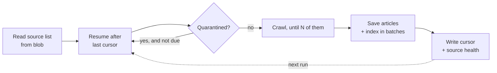

# Discovery Cadence

> How often discovery runs, how much it does per run, and how to change it.
> Companion to [system-design.md](system-design.md).

Sized against the source list on **30 August 2026**: 46,083 sources, 38,403 with a feed
and 7,680 without.

## Summary

| Setting                           | Deployed      | Code default    | Meaning                                   |
| --------------------------------- | ------------- | --------------- | ----------------------------------------- |
| `BLOGME_DISCOVERY_SCHEDULE`       | `0 0 * * * *` | `0 0 */6 * * *` | Timer cron, hourly                        |
| `BLOGME_DISCOVERY_BATCH`          | `1000`        | `200`           | Crawlable sources examined per run        |
| `BLOGME_MAX_POSTS_PER_SOURCE`     | `30`          | `15`            | Newest posts read per source              |
| `BLOGME_SOURCE_FAILURE_THRESHOLD` | code default  | `3`             | Failures running before quarantine        |
| `BLOGME_QUARANTINE_DAYS`          | code default  | `7`             | How often a quarantined source is retried |

All five are Function App application settings, so changing cadence is a configuration
change and needs **no redeploy**. The deployed values override the code defaults in
[config.go](../api/config.go); the fallbacks apply only when a setting is absent.

The first three are applied by [provision.sh](../infra/provision.sh), so a rebuilt
environment comes up at the deployed cadence rather than the code defaults. Change them
there rather than in the portal alone — the portal value is the one a provision run
overwrites. The two quarantine settings are deliberately not in `provision.sh`: their code
defaults are the intended values, and repeating them there would be two more places to
disagree. Set them explicitly only when moving off the defaults.

## Why discovery is batched

One run cannot walk the whole list. The corpus is tens of thousands of sources, each
needing a robots.txt check, a feed or sitemap read, and a fetch per new post, while the
Functions host caps an invocation at **30 minutes**.

So each run takes a slice of the list and records the last source it handled. The next run
resumes after it and wraps around at the end, giving every source regular coverage without
any single run approaching the timeout.



## Choosing a cadence

Coverage is simply how many sources a day the schedule gets through:

```text
sources/day = (24 / schedule_hours) x batch_size
full pass   = 46,083 / sources per day
```

| Batch     | Schedule   | Sources/day | Full pass    |
| --------- | ---------- | ----------- | ------------ |
| 200       | every 6h   | 800         | 58 days      |
| 500       | hourly     | 12,000      | 3.8 days     |
| **1,000** | **hourly** | **24,000**  | **1.9 days** |
| 2,000     | hourly     | 48,000      | 1.0 days     |

The code defaults are deliberately conservative and are **not** a recommendation for
production. At 58 days per pass a blog's new post could take two months to become
searchable, which defeats the goal in the
[high-level plan](plans/blog-discovery-search-high-level-plan.md) that new posts appear
automatically.

**Deployed:** batch 1,000, hourly. Measured against the 19,383-entry list of 18 August, a
run of 500 took a median of **188 seconds**, or 0.36 seconds per source, so 1,000 landed
near six minutes — a fifth of the invocation ceiling. That headroom was the point: the
list has since roughly doubled, and a run's cost per source is not a constant (see
below), so the figure above is a floor rather than a current measurement.

## Constraints to respect

**Stay well inside the timeout.** The cursor is written only after a run finishes, so a run
killed at 30 minutes records no progress and the same slice is retried next time. Work is
not lost or duplicated in the index, but it is wasted. Target a run that finishes in about
half the ceiling, and lower `BLOGME_DISCOVERY_BATCH` if runs creep up.

This is not hypothetical. On 17 August 2026, against a longer source list, **twelve
consecutive hourly runs hit the ceiling at batch 500** and advanced the cursor not at all;
the same batch against the current list takes three minutes. Cost per source moves by an
order of magnitude with the composition of the list, which is why a batch is sized against
the worst run rather than the median.

Each source also carries its own 90-second deadline. One source can otherwise string
together a robots fetch, several sitemap probes and a page fetch per post, each with its own
client timeout, so its worst case was the sum of all of them — which made a run's length a
hope rather than a calculation. Whatever a slow source gathered before its deadline is still
kept.

**Batch size is bounded by concurrency, not by the timeout alone.** Processed one at a
time, a few hundred sources will not fit in 30 minutes. A bounded pool of concurrent
fetches is what makes larger batches viable.

**Be polite to the sites being crawled.** Cadence is not only an internal capacity
question:

- Honour robots.txt, per [RFC 9309](https://www.rfc-editor.org/rfc/rfc9309). Done, including
  wildcards, `$` anchors, `Allow` and longest-match precedence. Matching used to be a literal
  prefix comparison, which meant every wildcard rule silently failed to match and the crawler
  fetched exactly what the site had asked it not to.
- Limit concurrency per host, not just overall. Done, and by registrable domain rather
  than by hostname — shared platforms put thousands of sources on one server, each as its
  own subdomain, so a per-hostname cap would not have limited anything.
- Send conditional requests. **Not yet implemented, and the largest saving still
  available.** Feeds normally support `ETag` and `If-Modified-Since`, so an unchanged feed
  would cost a `304` rather than a full download. Today every pass re-fetches every feed
  in its slice in full, and re-fetches the page behind any post whose feed entry is a
  stub. Doing this is what makes a faster cadence cheap rather than merely possible.

**Feeds and sitemaps cost differently.** 83% of sources publish a feed, which is one cheap
request. The remaining 7,680 need a sitemap walk, which is heavier and is what pushes a
run towards the ceiling. If cadence becomes expensive, checking feed-backed sources more
often than sitemap-only ones is the obvious split, but it is not worth the complexity
until measurements justify it. Finding more feeds when the source list is built is the
cheaper fix, because it moves the work off the crawler permanently.

**A source with no feed and no sitemap is read by neither path.** It stays in the list,
answers every request and contributes nothing, which from the outside is indistinguishable
from a blog that has not posted. Sampling the feedless sources put roughly a fifth in that
position, and every one of them advertised a working feed that the source list had simply
never recorded. So when the sitemap path finds nothing, the crawler reads the homepage and
uses a feed the site advertises there. It costs one request, and only where the
alternative is nothing at all — but a run of `recovered feed from site html` lines means
the source list is out of date, not that the crawler is healthy.

**A recorded feed that has gone stale is the same hole, better hidden.** A feed URL that
now 404s, or whose XML no longer parses, used to end the source outright: having a feed
sent it down the fast path, and failing there returned an error rather than trying
anything else. The blog was then in the list contributing nothing, exactly like the case
above, except that the list said it had a feed — so the failure read as a quiet blog
rather than a broken route. A feed going stale is not evidence a blog stopped publishing,
so the recorded feed is now cleared on failure and the source takes the sitemap and
homepage routes a feedless one already gets. Measured over one day in September 2026,
125 sources still fail on `fetch feed` and 79 on `parse feed`; before the fallback those
204 had no second route at all.

The error a wholly failed source reports is still the feed's, not the sitemap's, because
the feed is the one naming a correction [`blogs-overrides.yml`](../sources/README.md#corrections-by-hand)
can carry.

**A source that fails every route is quarantined rather than retried forever.** Falling
through the ladder is what makes a failure expensive: robots, the feed, several sitemap
probes, the homepage, then any feed advertised there. Paying that every pass for a source
that will never answer is the single largest piece of waste in a run, and it was being
paid on about a tenth of the list — see [quarantine](#quarantine) below.

**The feed window decides what can ever be found.** A feed lists only its most recent
posts, and the crawler reads the newest `BLOGME_MAX_POSTS_PER_SOURCE` of them. Anything
that falls past that window before the source is first crawled successfully is not late,
it is unreachable: the feed path never revisits it, and only the sitemap path consults
`store.Has` to fill gaps. A blog with no sitemap has no second route at all, so its
history is exactly what its feed still lists. This is why the setting is 30 rather than
the code's 15 — a blog that was in the list for months without a working feed comes back
with a backlog, and a window of 15 silently truncates it. Raising it is a configuration
change, but it is not free: it scales both the fetches per pass and the documents in the
index, so weigh it against the two ceilings below.

**Storage caps bite before compute does.** The 50 MB Free-tier ceiling was reached first,
which is why the service now runs on Basic; see [tech-stack.md](tech-stack.md). Cadence
sets how fast the next ceiling arrives, so check index size against the
[service limits](https://learn.microsoft.com/en-us/azure/search/search-limits-quotas-capacity)
before raising it. Truncating articles to 1,000 words is what keeps a document to roughly
6 KB — that cap is the main lever on index size, so raising it for recall and raising
cadence for freshness both spend the same budget.

Typeahead added about **0.8 KB** to that figure, measured on a 20,000-title probe: 295
bytes for `titleSuggest` and 500 for the prefixes generated from it, roughly 12% on top
of what a document already costs. `authorText` added a further 213 bytes. Both are spent
for good, because a field cannot be deleted from an index without a rebuild — see
[how it works](how-it-works.md) for why each is a copy of a field already there. The
lever is `--since` on [`backfill-suggest.sh`](../infra/backfill-suggest.sh): completing
only from articles published since a given date scales the cost with the fraction of the
corpus that qualifies, and arguably improves the completions by keeping a decade-old
vocabulary out of them.

Raising the window to 30 did exactly what the paragraph above warns of, and the figures
are the reason to take that warning seriously:

| Measured                | 20 Aug 2026 | 21 Aug 2026, 12:00 UTC |
| ----------------------- | ----------- | ---------------------- |
| Documents in the index  | 417,885     | 531,757                |
| Index storage           | 2.4 GB      | 3.24 GB (20% of quota) |
| Articles found per pass | ~9,500      | ~13,800                |

Index storage grew about 0.89 GB a day over that period, which put Basic's 15 GiB quota
roughly two weeks out. The reasoning against taking that seriously was that it should
flatten: a full sweep takes about two days, so a wider window works through the corpus
once and then meets posts it has already indexed. **It flattened later and higher than
that argued.** By 28 August the index held 1,197,546 documents at 7.4–8.4 GB — about
half the quota — still gaining some 95,000 documents a day. A projection is a thing to
watch, not a thing to reason away: `blogme-index-storage-high` fires at 60% of quota and
indexing fails outright at 100%, which makes that alert the last comfortable moment to
choose between pruning the corpus and changing tier.

**On 2 September the index held 1,423,736 documents at 9.28 GB — 57.6% of quota.** Growth
has genuinely slowed, to roughly 45,000 documents a day, or about 0.29 GB at a steady
6.5 KB each. That is the flattening the paragraph above hoped for and it arrived too late
to be much comfort: the 60% alert is a day or two out, and the hard ceiling about three
weeks. Pruning is a smaller lever than it looks — `quality lt 0.1` is 178,474 documents,
some 1 GB, which is four days of growth — so the decision that alert is asking for is
tier or retention, not a one-off clear-out. Note also that deleting at this fill level
carries the same transient inflation a backfill does, since a merge is a delete and a
reinsert, so a large prune wants doing in batches with `/indexes/articles/stats` watched
between them.

Two traps sit in the way of watching it. Counts disagree — `/servicestats` reported
531,757 documents against a match-all's 432,325 — because service statistics are
documented as approximate and this index is written to every hour. And `storageSize`
moves by around a gigabyte between readings an hour apart, as segments merge, so read
the trend and not the point. It is still the number quota is enforced against, so size
decisions use it rather than either document count.

**Compute is the cheap part.** The plan is Flex Consumption with 2 GB instances, billed at
$0.000037 per GB-second beyond a monthly grant of 100,000 GB-seconds. At batch 500 the
hourly timer spent about 259,000 GB-seconds a month, or $6; batch 1,000 roughly doubles
that to $15. Against Azure AI Search Basic, which is a fixed monthly charge whatever the
cadence, doubling freshness is close to free. The ceiling that matters is the 30-minute
invocation, not the bill.

## Quarantine

About a tenth of the list fails on every pass, and almost none of it is coming back.
Measured over four days at the start of September 2026:

|                                         |                                              |
| --------------------------------------- | -------------------------------------------- |
| Sources failing per pass, of 1,000      | 89 (max 152)                                 |
| Distinct sources failing over four days | 4,210 (9.1% of the list)                     |
| …that failed more than once             | 3,915 (93%)                                  |
| Failures that are `404`                 | 65%                                          |
| Failures that are timeouts              | 3%                                           |
| Crawl time spent on them                | 471 s a pass of ~3,776 available (**12.5%**) |

The decisive figure is not in that table. Of 300 persistently-failing sources sampled
against the index, **291 had never contributed a single article** — and the nine that had
contributed 194 documents between them, 0.014% of the corpus. These are overwhelmingly
not blogs that died and left stale content behind; they are entries that never worked,
extractor false positives like library documentation, government data portals and
near-duplicate hosts. There is nothing of theirs to retire. There is only work to stop
doing.

So [health.go](../api/internal/discovery/health.go) keeps a `failures` count per source in
`sources/source-health.json`, beside the cursor and `popularity.json`. A source that fails
`BLOGME_SOURCE_FAILURE_THRESHOLD` passes running is set aside and probed once every
`BLOGME_QUARANTINE_DAYS` instead of on every pass. One success clears the count outright,
so a blog that comes back is fully restored by the first pass that reaches it.

At the deployed cadence a full sweep takes about two days, so a threshold of 3 is roughly
six days of consistent failure before anything is set aside — comfortably longer than an
outage, and 93% of failures already repeat within one sweep.

**Skipped sources do not count against the batch.** A pass walks past them and pulls in
further sources to reach a full `BLOGME_DISCOVERY_BATCH`, so quarantine widens the ground
a pass covers rather than shrinking the work it does. The scan is bounded at three times
the batch, because the alternative on a list where everything is quarantined is walking
all 46,083 entries every pass to find nothing. The cursor records the last source
**examined**, not the last one crawled, or the sources passed over at the end of a batch
would be re-walked by the next pass forever.

Replaying `batchFrom` over the real list and the real 3,915 dead IDs, a full sweep of the
live corpus takes **43 passes instead of 47**, and the 3,981 wasted crawls in it go to
nothing but the weekly probes. Two different figures are quoted for the same waste and
both are right: dead sources are 8.5% of the list by count and 12.5% of a pass by time,
because failing is what sends a source down the whole route ladder.

Three failure modes are deliberately not counted:

- **Cancellation.** A pass cut short by a deploy or by the invocation ceiling cancels
  every crawl still in flight. Counting those would quarantine hundreds of healthy blogs
  at once, which is a far worse failure than the one quarantine exists to fix. A
  *deadline* is counted, because a source that spent its own 90 seconds and returned
  nothing has genuinely cost the run.
- **A pass where everything failed.** The existing all-failed guard returns before health
  is saved, so the whole pass is discarded. Nothing succeeding is evidence about the
  network, not about the blogs.
- **A pass that could not read the blob.** Health is advisory: an unreadable blob logs a
  warning and the pass crawls everything, which is exactly what it did before any of this
  existed.

`BLOGME_SOURCE_FAILURE_THRESHOLD=0` turns the whole mechanism off without a deploy, which
is the escape hatch if it ever sets aside something it should not.

**What it is worth watching.** Every pass logs `quarantined`, the standing count of
sources currently set aside, on both the starting and the completing line. That number is
a far better measure of source-list rot than the raw `sources_failed` it replaces: it
counts distinct sources rather than attempts, and it does not fall simply because a pass
happened to walk a healthy stretch of the list. A `quarantined` figure climbing across
rebuilds is the signal that the extractor needs another run; one that jumps suddenly is
much more likely to mean the crawler has been blocked than that 4,000 blogs died at once.

```bash
az monitor log-analytics query -w <WORKSPACE_GUID> --analytics-query   "AppTraces | where TimeGenerated > ago(7d) | where Message startswith 'discovery pass complete' | extend q = toint(extract('quarantined=([0-9]+)', 1, Message)) | project TimeGenerated, q | order by TimeGenerated asc"
```

The blob is also the report. An entry with a `failures` count and no `lastOk` has never
worked once, which makes it a candidate for removal from `blogs.yml` rather than a blog
having a bad month — the distinction the source list cannot currently draw for itself.
Feeding that back into the list automatically is the next step and is deliberately not
built yet: the crawler already routes around every one of these cases at runtime, so what
it costs today is invisibility rather than breakage.

## Changing it

```bash
az functionapp config appsettings set \
  --name <FUNCTION_APP> --resource-group <RESOURCE_GROUP> \
  --settings BLOGME_DISCOVERY_BATCH=1000 BLOGME_DISCOVERY_SCHEDULE="0 0 * * * *"
```

Record the new number in [provision.sh](../infra/provision.sh) too. These settings are
declared there, so a value changed only by the command above survives until the next
provision run and is then silently put back.

Applying this restarts the app, so confirm `/api/health` returns `200` afterwards — it
reads the index, so a `200` means search works rather than only that the app came back.
Read the values back with:

```bash
az functionapp config appsettings list \
  --name <FUNCTION_APP> --resource-group <RESOURCE_GROUP> \
  --query "[?starts_with(name,'BLOGME_DISCOVERY')].{name:name,value:value}" -o table
```

The schedule is a six-field NCRONTAB expression, where the first field is seconds.

| Expression       | Meaning          |
| ---------------- | ---------------- |
| `0 0 */6 * * *`  | Every six hours  |
| `0 0 * * * *`    | Hourly           |
| `0 */30 * * * *` | Every 30 minutes |

## Measuring a run

Before raising the batch, check what runs cost now. Flex Consumption reports execution
units in MB-milliseconds, so dividing by the instance size gives the duration:

```bash
az monitor metrics list \
  --resource "$(az functionapp show -g <RESOURCE_GROUP> -n <FUNCTION_APP> --query id -o tsv)" \
  --metric OnDemandFunctionExecutionUnits --interval PT1H --aggregation Total \
  --start-time "$(date -u -d '2 days ago' +%Y-%m-%dT%H:%M:%SZ)" -o json
```

One hourly timer means one point per run. A point near `1800` seconds is a run that was
killed at the ceiling and advanced nothing.

The execution-unit metric is sparse and easy to misread. The pass logs are the
reliable source, and they live in the Log Analytics workspace behind Application
Insights. Query the **workspace** rather than the component: `az monitor app-insights
query` silently applies its own narrow default timespan, so a `where TimeGenerated >
ago(14d)` clause in that command can still return only the last hour and make a healthy
app look like it has no history.

```bash
az monitor log-analytics query -w <WORKSPACE_GUID> --analytics-query   "AppTraces | where TimeGenerated > ago(7d) | where Message has 'discovery pass complete'"
```

## Alerting

Nothing watches a run except these rules, and the reason they exist is that on
17 August 2026 twelve of fourteen passes died at the 30-minute ceiling for half a day
and nothing said so. They are created by [`alerts.sh`](../infra/alerts.sh) and all
notify the `ag-blogme-ops` action group.

| Rule                              | Fires when                                            | Sev | Needs   |
| --------------------------------- | ----------------------------------------------------- | --- | ------- |
| `blogme-job-run-failed`           | a pass fails or is killed at the ceiling              | 1   | 2 of 3  |
| `blogme-discovery-cursor-stalled` | 2+ passes complete in 4h without advancing the cursor | 1   | 1 of 1  |
| `blogme-discovery-not-running`    | no pass completes at all in 12h                       | 1   | 1 of 1  |
| `blogme-job-slow`                 | a pass exceeds 15 minutes, half the ceiling           | 2   | 2 of 3  |
| `blogme-index-storage-high`       | index storage passes 60% of Basic's 15 GiB quota      | 2   | 6h avg  |
| `blogme-search-failing`           | searches return errors                                | 2   | 2 of 3  |
| `blogme-instances-scaling-out`    | more than 5 instances are running                     | 2   | 15m avg |

The first four watch whether a pass ran. `blogme-index-storage-high` watches what the
passes have been accumulating, which no amount of run-level success would ever reveal.
`blogme-search-failing` watches the read path the corpus exists to serve. And
`blogme-instances-scaling-out` watches the bill: instances are what the app is charged
for, normal operation has never needed more than two, and a budget alert would notice a
runaway a day late (see [tech-stack.md](tech-stack.md#infrastructure)).

**The "needs" column is what keeps them quiet.** A single failed pass is not an incident:
the cursor only advances on success, so a pass killed by a deploy simply re-runs the
identical range an hour later. Requiring two of three consecutive evaluations means a
transient failure passes in silence while a genuine outage — twelve of fourteen passes,
as on 17 August — still alerts within two hours. `blogme-index-storage-high` averages over
six hours for the same reason: indexing briefly allocates well above the resting size, and
a rule reading the peak would flap across the threshold for days.

A percentage is the wrong shape for a rule here and it is worth saying why, because the
metric exists and looks useful. `ThrottledSearchQueriesPercentage` was tried and removed:
at roughly six searches an hour, one throttled query is one hundred percent of its minute,
and no averaging window repairs that — the empty minutes contribute no samples to average
against. `blogme-search-failing` counts failed requests instead, so quiet traffic produces
small numbers rather than large percentages.

The cursor rule is the one that matters most, because it is the only end-to-end check:
a pass can succeed, log cheerfully and still advance nothing, and the cursor is the only
place that shows it.

**Why that is two rules and not one.** It began as one, firing on an empty window so that
it covered the timer not firing as well as the timer failing. That looked like thrift and
was a bug: a log query cannot distinguish a stalled job from a job whose log lines have
not arrived, and an empty window is exactly what a late one looks like. On 30 August 2026
an Azure ingestion stall delayed an afternoon of telemetry by up to six hours — dropping
some of it for good — and the rule paged at severity 1 while discovery was advancing its
cursor every hour, as the cursor blob itself showed throughout.

So each half now asks something a delayed pipeline cannot fake. The stall rule requires
two observed passes before it will call a cursor frozen, because a genuine freeze still
reports four passes in four hours while late telemetry reports fewer. The absence rule
takes a twelve-hour window instead of four, wide enough that a lost afternoon is not a
death: discovery completes a pass every hour without exception, the worst delay yet seen
lost seven consecutive hours of those lines, and the fewest in any 12h window across
three days was still five.

The lesson generalises to every rule here. Alerts built on logs inherit the reliability
of the log pipeline, so any rule that treats _no rows_ as _bad news_ is really watching
Azure Monitor rather than blogme. When a rule fires and the app looks healthy, check
ingestion lag before believing it:

```bash
az monitor log-analytics query -w <WORKSPACE_GUID> --analytics-query   "AppTraces | where TimeGenerated > ago(6h) | extend LagMin = (ingestion_time() - TimeGenerated) / 1m | summarize p50 = percentile(LagMin, 50), max = max(LagMin)"
```

Normal here is under a minute. The blob timestamps settle it outright, since they depend
on nothing Azure Monitor does: `sources/discovery-cursor` is rewritten on every
successful pass, and `azure-webjobs-hosts/timers/<host-id>/Host.Functions.discover/status`
holds the host's own record of when the timer last fired and when it fires next.

**Nothing yet alerts on `quarantined`, deliberately.** A rule wants a threshold, and the
only honest source of one is a month of readings after quarantine has drained its backlog
— the count starts at zero, climbs as the existing ~4,200 dead sources are found three
passes at a time, and only then settles somewhere worth alerting above. Guessing now would
produce a rule that fires for a fortnight while the mechanism works correctly, which is how
an alert gets muted and then ignored. The query above is the interim answer; set a
threshold from the readings once the backlog has drained.

## When batching stops being enough

Batching is the simple answer, and it holds while a run's work fits comfortably in one
invocation. Move to a queue with parallel workers, as anticipated in
[system-design.md](system-design.md), when either:

- a batch large enough to keep pace no longer fits in the timeout, even with concurrency; or
- runs regularly approach the ceiling and the cursor stops advancing reliably.

At that point a planner enqueues one message per source and workers process them
independently, so throughput scales with instance count instead of with the length of a
single run.

## References

- [Azure Functions timer trigger](https://learn.microsoft.com/en-us/azure/azure-functions/functions-bindings-timer)
- [NCRONTAB expressions](https://learn.microsoft.com/en-us/azure/azure-functions/functions-bindings-timer#ncrontab-expressions)
- [Azure Functions Flex Consumption plan](https://learn.microsoft.com/en-us/azure/azure-functions/flex-consumption-plan)
- [Azure AI Search service limits](https://learn.microsoft.com/en-us/azure/search/search-limits-quotas-capacity)
- [RFC 9309 — Robots Exclusion Protocol](https://www.rfc-editor.org/rfc/rfc9309)
- [Sitemaps Protocol](https://www.sitemaps.org/protocol.html)
