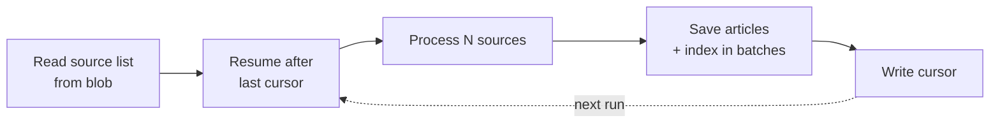

# Discovery Cadence

> How often discovery runs, how much it does per run, and how to change it.
> Companion to [system-design.md](system-design.md).

Sized against the generated source list on **16 August 2026**: 28,269 sources, 19,221 with a
feed and 9,048 without.

## Summary

| Setting | Default | Meaning |
| --- | --- | --- |
| `BLOGME_DISCOVERY_SCHEDULE` | `0 0 */6 * * *` | Timer cron, every six hours |
| `BLOGME_DISCOVERY_BATCH` | `200` | Sources examined per run |

Both are Function App application settings, so changing cadence is a configuration change
and needs **no redeploy**.

## Why discovery is batched

One run cannot walk the whole list. The corpus is tens of thousands of sources, each
needing a robots.txt check, a feed or sitemap read, and a fetch per new post, while the
Functions host caps an invocation at **30 minutes**.

So each run takes a slice of the list and records the last source it handled. The next run
resumes after it and wraps around at the end, giving every source regular coverage without
any single run approaching the timeout.



## Choosing a cadence

Coverage is simply how many sources a day the schedule gets through:

```text
sources/day = (24 / schedule_hours) x batch_size
full pass   = 28,269 / sources per day
```

| Batch | Schedule | Sources/day | Full pass |
| --- | --- | --- | --- |
| 200 | every 6h | 800 | 35 days |
| 500 | hourly | 12,000 | 2.4 days |
| 1,000 | hourly | 24,000 | 1.2 days |
| 2,000 | hourly | 48,000 | 0.6 days |

The defaults are deliberately conservative and are **not** a recommendation for production.
At 35 days per pass a blog's new post could take a month to become searchable, which
defeats the goal in the [high-level plan](blog-discovery-search-high-level-plan.md) that
new posts appear automatically.

**Recommended once the crawler exists:** batch 500, hourly. That is a full pass every
2.4 days, which is a reasonable freshness target for long-form writing that is published
weekly at best. Raise it only after measuring how long a real run takes.

## Constraints to respect

**Stay well inside the timeout.** The cursor is written only after a run finishes, so a run
killed at 30 minutes records no progress and the same slice is retried next time. Work is
not lost or duplicated in the index, but it is wasted. Target a run that finishes in about
half the ceiling, and lower `BLOGME_DISCOVERY_BATCH` if runs creep up.

**Batch size is bounded by concurrency, not by the timeout alone.** Processed one at a
time, a few hundred sources will not fit in 30 minutes. A bounded pool of concurrent
fetches is what makes larger batches viable.

**Be polite to the sites being crawled.** Cadence is not only an internal capacity
question:

- Honour robots.txt, per [RFC 9309](https://www.rfc-editor.org/rfc/rfc9309).
- Limit concurrency per host, not just overall. Many sources share hosting.
- Send conditional requests. Feeds normally support `ETag` and `If-Modified-Since`, so an
  unchanged feed costs a `304` rather than a full download. This is the single largest
  saving available and it makes a faster cadence far cheaper.

**Feeds and sitemaps cost differently.** 68% of sources publish a feed, which is one cheap
request. The remaining 9,048 need a sitemap walk, which is heavier. If cadence becomes
expensive, checking feed-backed sources more often than sitemap-only ones is the obvious
split, but it is not worth the complexity until measurements justify it.

**Storage caps bite before compute does.** On the Azure AI Search Free tier the 50 MB
ceiling holds roughly 25,000 to 50,000 article documents. A faster cadence fills that
sooner. See [tech-stack.md](tech-stack.md) for when to move to Basic.

## Changing it

```bash
az functionapp config appsettings set \
  --name <FUNCTION_APP> --resource-group <RESOURCE_GROUP> \
  --settings BLOGME_DISCOVERY_BATCH=500 BLOGME_DISCOVERY_SCHEDULE="0 0 * * * *"
```

The schedule is a six-field NCRONTAB expression, where the first field is seconds.

| Expression | Meaning |
| --- | --- |
| `0 0 */6 * * *` | Every six hours |
| `0 0 * * * *` | Hourly |
| `0 */30 * * * *` | Every 30 minutes |

## When batching stops being enough

Batching is the simple answer, and it holds while a run's work fits comfortably in one
invocation. Move to a queue with parallel workers, as anticipated in
[system-design.md](system-design.md), when either:

- a batch large enough to keep pace no longer fits in the timeout, even with concurrency; or
- runs regularly approach the ceiling and the cursor stops advancing reliably.

At that point a planner enqueues one message per source and workers process them
independently, so throughput scales with instance count instead of with the length of a
single run.

## References

- [Azure Functions timer trigger](https://learn.microsoft.com/en-us/azure/azure-functions/functions-bindings-timer)
- [NCRONTAB expressions](https://learn.microsoft.com/en-us/azure/azure-functions/functions-bindings-timer#ncrontab-expressions)
- [Azure Functions Flex Consumption plan](https://learn.microsoft.com/en-us/azure/azure-functions/flex-consumption-plan)
- [Azure AI Search service limits](https://learn.microsoft.com/en-us/azure/search/search-limits-quotas-capacity)
- [RFC 9309 — Robots Exclusion Protocol](https://www.rfc-editor.org/rfc/rfc9309)
- [Sitemaps Protocol](https://www.sitemaps.org/protocol.html)
