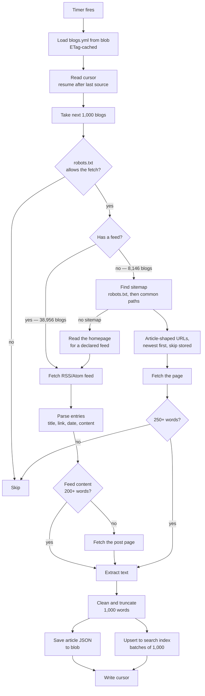
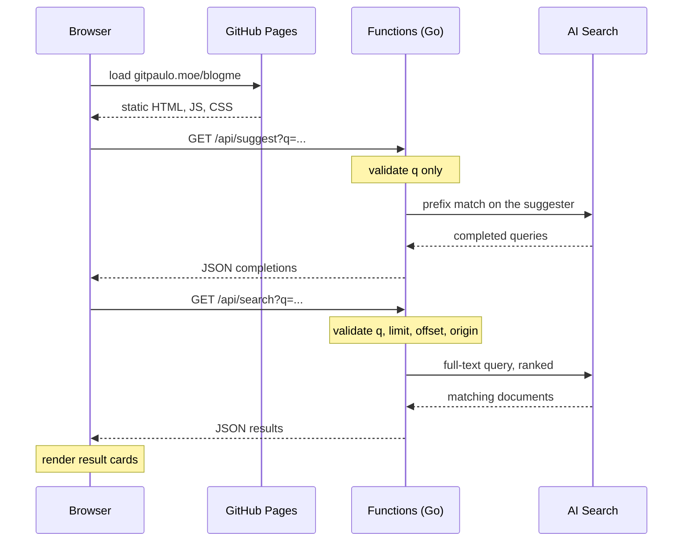
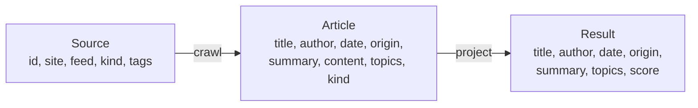
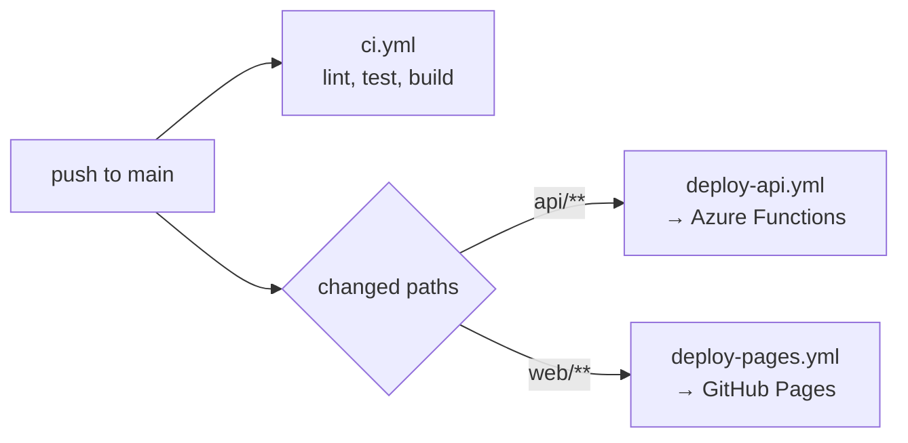

# How It Works

An end-to-end walkthrough of blogme, from a list of blogs to a search result.

For the reasoning behind these choices see [system design](system-design.md),
[tech stack](tech-stack.md) and the [high-level plan](blog-discovery-search-high-level-plan.md).

## Overview

There are two independent paths through the system. The **write path** fills the corpus
on a timer; the **read path** answers a user's query. They meet only at the search index.


The two paths are deliberately decoupled: discovery can fail entirely and search keeps
working against whatever is already indexed.

## Write path — filling the corpus

Runs on a timer. Each pass handles a slice of the source list and records where it
stopped, so no single run approaches the function timeout.



A feed describes its own posts, so it is both cheaper and more accurate: one request
usually yields every recent post, with a title, a link and a date already attached. The
sitemap path exists for the third of the corpus that publishes no feed. It is slower by
design — a sitemap lists every page a site has, so each candidate must be fetched before
it can be judged, and the word count is what separates a post from a landing page. Which
path found an article is recorded on it as its **origin**, because sitemap metadata is
the less dependable of the two and the UI says so.

A blog with neither is read by neither path, so before giving up the crawler reads the
homepage and uses a feed the page advertises. That is a repair, not a route: it means
the source list is missing a feed the blog has been publishing all along, and the
durable fix is [`blogs-overrides.yml`](../sources/README.md#corrections-by-hand).

Key properties:

| Property        | How                                                                       |
| --------------- | ------------------------------------------------------------------------- |
| Bounded runtime | Fixed batch of blogs per run, never the whole list                        |
| Resumable       | Cursor stores the last source **ID**, so it survives list regeneration    |
| Polite          | robots.txt respected; concurrency capped per registrable domain           |
| Idempotent      | Article IDs are the source plus a hash of the URL, so re-crawling updates |
| Incremental     | Sitemap pages already stored are skipped, so later runs reach deeper      |
| Fault isolated  | One failing blog is logged and skipped; the pass continues                |

The per-domain cap matters more than it looks: shared platforms host thousands of the
sources, with `bearblog.dev` alone accounting for over a thousand. Limiting by hostname
would not help, because each blog is its own subdomain of the same server.

Idempotent within a source, that is, and the qualifier is the interesting part. Because
the id carries the source, one article reachable from two of them is two documents —
two blobs, two index entries, two rows competing for a page. That happens whenever the
list holds a site twice, or an aggregator republishes somebody else's post: searching
"claude" returned twenty rows of which seventeen were distinct, three of them repeats of
the same two articles. So duplicates are removed at three points, and each one covers
something the others cannot see:

| Where            | Removes                                           |
| ---------------- | ------------------------------------------------- |
| Source list      | Platform roots that shadow the writers beneath    |
| API, per page    | A URL already used by an earlier row on that page |
| Browser, on load | A URL already on screen from an earlier page      |

The source list is the only place that can stop the duplicate being crawled at all; the
API is the only place that sees a whole page before anyone renders it; and the browser is
the only one that can see across pages. Removing the cause upstream does not retire the
guards downstream, because the list is rebuilt from other people's lists and will always
find new ways to name the same blog twice.

## Read path — answering a query



The site is static and holds no credentials. The function app authenticates to Azure
with a managed identity, so no keys exist in the browser or in the repository.

Every query parameter is validated before it reaches the index, and the one filter the
API offers — `origin`, which narrows results to feed or sitemap discoveries — is built
from a fixed set of expressions rather than from the caller's string, so no filter can be
injected through the query.

The endpoint is anonymous, so there is no key to revoke and a **rate limit** is what
stands between a script and the bill. Callers are identified by the address Azure appends
to `X-Forwarded-For`, and a throttled request is answered with `429`, `Retry-After` and
the `RateLimit-*` headers. Semantic queries carry a second, tighter allowance — per caller
and across the service — because reranking spends from a metered monthly quota rather than
from capacity that renews by the minute.

| Setting                              | Default | Applies to             |
| ------------------------------------ | ------- | ---------------------- |
| `BLOGME_SEARCH_RATE_PER_MINUTE`      | 60      | One caller, any search |
| `BLOGME_SEARCH_RATE_BURST`           | 60      | One caller, any search |
| `BLOGME_SEARCH_RATE_ALL_PER_MINUTE`  | 600     | Everyone, any search   |
| `BLOGME_SEARCH_RATE_ALL_BURST`       | 300     | Everyone, any search   |
| `BLOGME_SEMANTIC_RATE_PER_MINUTE`    | 10      | One caller, semantic   |
| `BLOGME_SEMANTIC_RATE_BURST`         | 5       | One caller, semantic   |
| `BLOGME_SEMANTIC_RATE_PER_HOUR`      | 60      | Everyone, semantic     |
| `BLOGME_SEMANTIC_RATE_HOUR_BURST`    | 15      | Everyone, semantic     |
| `BLOGME_SUGGEST_RATE_PER_MINUTE`     | 240     | One caller, typeahead  |
| `BLOGME_SUGGEST_RATE_BURST`          | 60      | One caller, typeahead  |
| `BLOGME_SUGGEST_RATE_ALL_PER_MINUTE` | 1200    | Everyone, typeahead    |
| `BLOGME_SUGGEST_RATE_ALL_BURST`      | 600     | Everyone, typeahead    |

The burst is sized against the client's own fan-out rather than against someone typing:
one "load more" chases page after page while a filter hides what arrives, so a reader
who clicks twice in quick succession spends tens of requests in a few seconds.

These are per instance, and Flex Consumption scales out, so they bound the blast radius
rather than enforce a budget: they turn "burn the month's reranking in a minute" into
"burn it over many hours", which is long enough to notice. The service-wide limits are
what bound a flood, because traffic spread over many addresses is polite at every one
of them; the instance ceiling on the plan is what turns that bound into a number.

A page carries at most three results from any one blog. Three posts from one site is
rarely what a reader wanted, and it means a source that stuffs its posts with popular
terms takes three rows rather than the page.

That cap thins a page after the index has already ranked it, which is a more awkward
thing to do than it sounds, and two pieces of the design exist only to make it safe.

**More documents are read than the page holds** — three for every row. Reading exactly a
page's worth returns however many happen to survive: searching "claude" gave three rows
out of twenty, because its first twenty-nine matches were all the same site. The other
seventeen rows were never missing, they simply sat past where a page-sized read looks;
the same query yields 24 usable rows inside its first 50 documents. In semantic mode the
read stops at the reranked window instead, since filling a page from past it would be
keyword ordering wearing a semantic label.

**The API says where the next page starts**, in `nextOffset`, and clients must use it
instead of adding their own page size. A page of twenty rows is not twenty documents
wide once the cap has removed some, so a fixed stride steps over whatever was removed and
skips it for good rather than deferring it. This is what makes "load more" reach every
result exactly once.

A search matches only documents containing **every** word of the query. Matching any of
them was the original choice, meant to hand the reranker a wide field to sort out, and
measured against the queries people actually type it was the wrong trade: "ai text
watermarks" reported 185,796 matches, of which 265 held all three words and the rest
merely said "text". Requiring all of them put "How AI text watermarking works" first and
moved a search for "sean goedecke" from rank 39 to 14 among his own posts, while leaving
the top of "github actions" — the most searched query here — untouched. Every query on
record still returns something.

Ranking happens in two stages. Keyword scoring picks the candidates, weighted towards the
title, and then Azure AI Search's **semantic ranker** reorders them with a language model
— which is what makes a query phrased as a sentence work rather than only a bag of
keywords. The reranker only reaches the top 50 keyword matches, so that window is also
the entire result set the API offers: past it, ordering would quietly revert to keyword
scoring part-way down a scroll. Reranking is metered, so a query is downgraded to keyword
ranking when the throttle says the budget is spent, and retried without it if the service
refuses anyway. Search degrades rather than failing, either way.

The index also carries a scoring profile named `relevance`, weighting title above author
above summary above content, and no query names it. It applies all the same: an index's
`defaultScoringProfile` is used by every query that does not choose one, which is why
naming it explicitly was measured against `claude`, `rust ownership`, `sean goedecke`,
`github actions` and `python` and returned byte-identical results every time. Both arms of
that comparison were running the same profile.

That matters now, because it is the hook the whole of
[quality-scoring.md](quality-scoring.md) hangs on: a scoring **function** added to the
default profile reaches every query without a line of code changing. The index carries
three further profiles that each differ from `relevance` by one variable, so which of
them should be the default is a question `make harness` can answer rather than one to
argue about.

A search lives in the address bar. The query and the ranking mode — everything the server
was asked for — are written back as `?q=` and `?mode=`, so a search can be shared,
reloaded or returned to. The remaining filters narrow the rows
already fetched rather than the query behind them, and a fresh search clears them, so they
stay out. The URL is written once per search rather than once per keystroke: partly
because it should describe results that exist, and partly because browsers throttle
history writes.

An answer is cacheable for two minutes, so a reload or a shared link opened twice costs
neither an execution nor an index query. Discovery runs hourly, so anything well inside
that cycle serves the corpus the index would have answered from anyway; a minute was
short enough to expire between a reader opening a result and coming back for the next
one. Only the answer is cached: an error describes this moment rather than the query,
and caching one would go on serving a failure the service had already recovered from.

Answers are gzipped when the caller says it can read them. A page of results is 10–18 KB
of JSON that compresses to 36–45% of that, for about 0.3 ms against a search whose median
is 31 ms — nearly all of what a reader waits for is the body crossing the network rather
than the search itself. The Functions host proxies the response back untouched, so this
happens in the worker or not at all. Bodies below 1 KB are sent as they are, because gzip
costs eighteen bytes of header and footer before any content and every error here is one
sentence. `Vary: Accept-Encoding` rides on both forms, since they share a URL and the
answer is cacheable and public.

`/api/suggest` completes the query being typed. It is the **autocomplete** half of Azure
AI Search's typeahead rather than the **suggest** half, which returns documents: the page
already searches on a pause in typing and renders titles live, so a dropdown of documents
would duplicate the result list directly underneath it. What the box could not do before
is say what is in the corpus, and that is what a completion is for. Each one is a whole
query rather than the word that finishes it, because a list reading "query, queue,
quantum" under a box saying "postgres qu" does not tell a reader what they are about to
search for.

Completions come from a **suggester**, which is an extra tokenisation of one field: the
titles are indexed again as prefixes, so "kubernetes" is also stored as "kub", "kube",
"kuber" and so on. That field is `titleSuggest`, a copy of `title`, and the copy is not an
oversight — Azure AI Search refuses to add an existing field to a suggester, because
prefixes are generated during indexing and an existing field is already tokenised. A
suggester on `title` itself would have meant dropping and rebuilding the index, which also
empties every quality score and costs days of degraded ranking to refill. A new field
alongside it costs about 0.8 KB per document, no downtime, and no rebuild.

Discovery writes `titleSuggest` for everything it indexes from now on, so only the
documents that predate the field need filling in. That is what
[`infra/backfill-suggest.sh`](../infra/backfill-suggest.sh) does, and it keeps no cursor:
a document leaves the set carrying no `suggestVersion` by being written, so reading the
head of that set repeatedly walks the corpus and then stops. The run is interruptible and
re-runnable for the same reason, and it never has to page past the `$skip` ceiling of
100,000.

Typeahead is where an anonymous endpoint is easiest to abuse, so `q` is the only thing
read from the request. How many completions come back, which suggester answers, and
whether matching is fuzzy are all fixed in the code: a caller sending `fuzzy=true` or
`top=100` gets the ordinary answer, because fuzzy matching measured four times the latency
of an exact one and nobody should be able to buy that with a query string. The allowance
is counted apart from search rather than shared with it — typeahead fires several times
per search by design, so one bucket would mean a reader typing one query tripped their own
limit for searching it — and it never touches the reranking budget, because nothing here
is metered. Completions are cacheable for an hour, against two minutes for a page of
results: prefixes are short and shared between readers, and the vocabulary of a million
titles does not turn over in an hour. Nothing is logged on the way through, only failures
and only in bounded form; the platform already counts invocations per function, so paying
for a log line per keystroke would buy nothing.

The browser does its share. It waits out a pause of 120 ms before asking, holds the
answers to the last hundred queries, and asks nothing at all below three characters — so
typing "rust" costs one request, and backspacing over it costs none. A query the reader
has just accepted is not completed back at them, which saves both a request and a dropdown
reopening under the cursor to offer the line already in the box.

`/api/health` asks the index for a document count rather than reporting that the process
is up. The deploy workflow gates on it, and the failures worth catching all authenticate
correctly — a role assignment that was never granted still issues a token, and a
misspelled index name is a valid request to somewhere that is not there. Both would ship
green and then fail every search. Counting is not a semantic query, so the check spends
nothing from the reranking quota.

## Logging

There is no logger to configure. The Functions Go worker installs one at import time:
its slog handler attaches `invocation_id`, `function_name` and `trigger_type` to every
record, and once the worker connects it sends them to the host over gRPC, which is what
puts them in Application Insights. HTTP handlers get this for free, because the
dispatcher hands the handler a request whose context carries the invocation.

Two rules follow, and the first one matters more than it looks:

- **Never call `slog.SetDefault`.** Installing a handler of our own replaces the SDK's,
  and records fall back to stderr without `invocation_id`. Nothing fails loudly; the logs
  simply stop being correlated.
  [`logging_test.go`](../api/internal/httpapi/logging_test.go) pins this.
- **Always use the `*Context` variants** — `slog.InfoContext(ctx, …)` — inside a request
  or a timer run. The plain `slog.Info` is right only at startup, where no invocation
  exists yet.

Levels carry a meaning worth keeping to:

| Level   | Means                                                           |
| ------- | --------------------------------------------------------------- |
| `Error` | We are broken and someone must look                             |
| `Warn`  | One input was bad, or a caller was refused; the run continued   |
| `Info`  | One line per unit of work — a search, a discovery pass, startup |
| `Debug` | Per-item detail, off by default                                 |

Field names are shared across packages so a query works everywhere: `duration_ms`,
`source_id`, `url`, `error`, `count`, `total`, `rank`, `kind`, `caller`.

Every search emits exactly one `search` record with the query, `count`, `total`, `rank`
and `duration_ms`. That one line is the difference between knowing search works and
assuming it: a corpus that has quietly stopped matching anything otherwise looks
identical to a quiet day. Queries are logged, capped at 128 characters and with control
characters folded to spaces so nothing in a query can forge a second log record. A
passing health check is deliberately not logged — it is polled, and one line per poll
would bury everything else — but a failing one is, because by then something is wrong
that nobody has noticed.

Turning on debug needs no redeploy. Add the app setting and restart:

```bash
az functionapp config appsettings set \
  --name <FUNCTION_APP> --resource-group <RESOURCE_GROUP> \
  --settings AzureFunctionsJobHost__logging__logLevel__default=Debug
```

The host pushes that threshold to the worker, which filters by category before anything
crosses the wire. Set it back to `Information` when finished — at `Debug` the discovery
job logs a line per source, which at 1,000 sources an hour is not something to leave on.

## Where each stage lives

| Stage                      | Code                                                                            |
| -------------------------- | ------------------------------------------------------------------------------- |
| Build the blog list        | [`sources/tools/`](../sources/tools/)                                           |
| Publish the list           | [`infra/upload-sources.sh`](../infra/upload-sources.sh)                         |
| Load and cache the list    | [`api/internal/sources`](../api/internal/sources)                               |
| Batching and cursor        | [`api/internal/discovery/discovery.go`](../api/internal/discovery/discovery.go) |
| Feeds, fetching, robots    | [`api/internal/discovery`](../api/internal/discovery)                           |
| Sitemap fallback           | [`api/internal/discovery/sitemap.go`](../api/internal/discovery/sitemap.go)     |
| Text extraction            | [`api/internal/discovery/extract.go`](../api/internal/discovery/extract.go)     |
| Canonical storage          | [`api/internal/store`](../api/internal/store)                                   |
| Index and query            | [`api/internal/index`](../api/internal/index)                                   |
| Typeahead                  | [`api/internal/index/suggest.go`](../api/internal/index/suggest.go)             |
| Backfilling `titleSuggest` | [`infra/backfill_suggest.py`](../infra/backfill_suggest.py)                     |
| HTTP handlers              | [`api/internal/httpapi`](../api/internal/httpapi)                               |
| Web UI                     | [`web/src`](../web/src)                                                         |

## Data at each stage

One line of `blogs.yml` becomes many search results:



A source's `tags` describe the blog, so on their own every post from it would be labelled
identically. On the feed path the post's own categories are added to them, which is the
only per-post subject signal available without reading the post. `kind` travels
unchanged: it is a fact about the blog, not about any one article.

Blob storage holds the canonical `Article`. The search index is a **projection** of it and
is treated as disposable: it can be dropped and rebuilt from blob at any time, which is
why moving between search tiers is cheap.

## Deployment



Both deploy workflows authenticate to Azure with OIDC federation, so no long-lived
credential is stored in GitHub. Publishing a new blog list is separate from deployment:
`make sources-upload` is enough, and the running job picks it up on its next pass.
