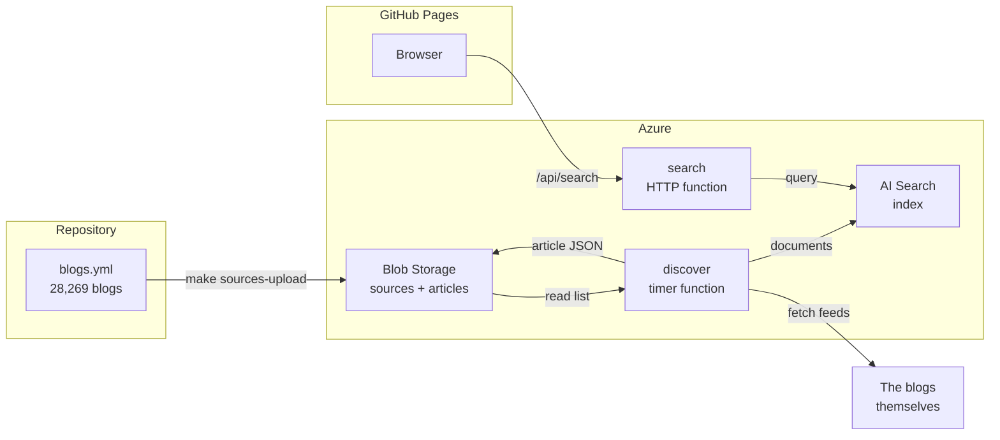
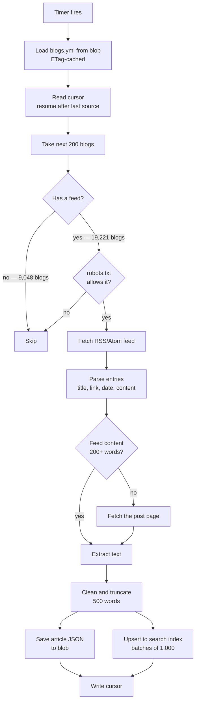
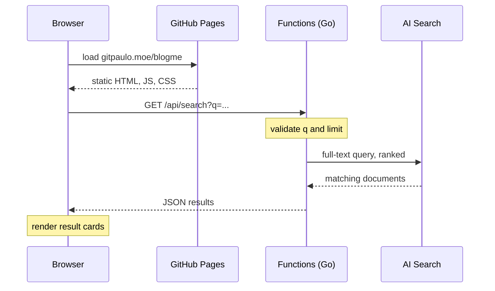
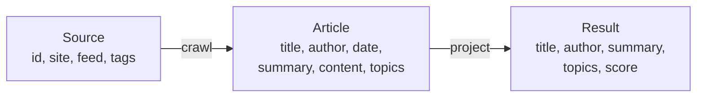
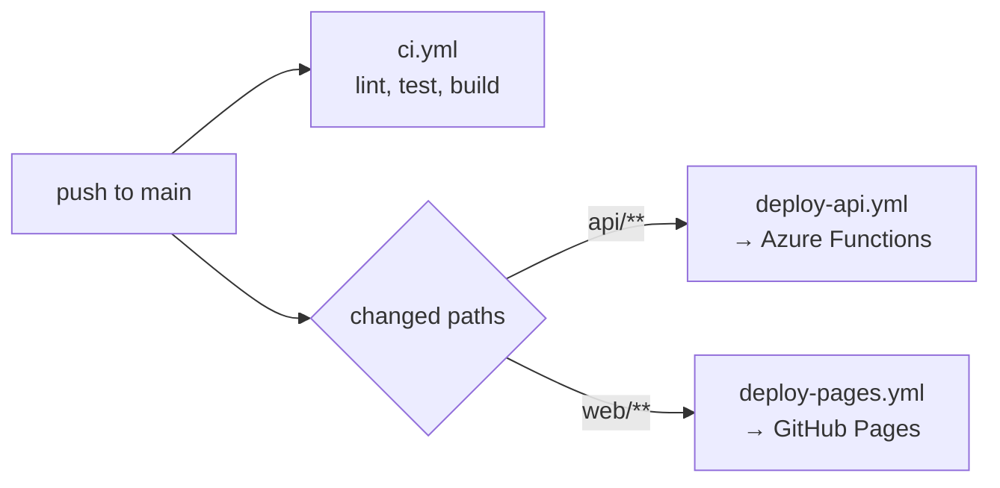

# How It Works

An end-to-end walkthrough of blogme, from a list of blogs to a search result.

For the reasoning behind these choices see [system design](system-design.md),
[tech stack](tech-stack.md) and the [high-level plan](blog-discovery-search-high-level-plan.md).

## Overview

There are two independent paths through the system. The **write path** fills the corpus
on a timer; the **read path** answers a user's query. They meet only at the search index.

The two paths are deliberately decoupled: discovery can fail entirely and search keeps
working against whatever is already indexed.

## Write path — filling the corpus

Runs on a timer. Each pass handles a slice of the source list and records where it
stopped, so no single run approaches the function timeout.

Key properties:

| Property | How |
| --- | --- |
| Bounded runtime | Fixed batch of blogs per run, never the whole list |
| Resumable | Cursor stores the last source **ID**, so it survives list regeneration |
| Polite | robots.txt respected; concurrency capped per registrable domain |
| Idempotent | Article IDs are a hash of the URL, so re-crawling updates rather than duplicates |
| Fault isolated | One failing blog is logged and skipped; the pass continues |

The per-domain cap matters more than it looks: shared platforms host thousands of the
sources, with `bearblog.dev` alone accounting for over a thousand. Limiting by hostname
would not help, because each blog is its own subdomain of the same server.

## Read path — answering a query

The site is static and holds no credentials. The function app authenticates to Azure
with a managed identity, so no keys exist in the browser or in the repository.

## Where each stage lives

| Stage | Code |
| --- | --- |
| Build the blog list | [`sources/tools/`](../sources/tools/) |
| Publish the list | [`infra/upload-sources.sh`](../infra/upload-sources.sh) |
| Load and cache the list | [`api/internal/sources`](../api/internal/sources) |
| Batching and cursor | [`api/internal/discovery/discovery.go`](../api/internal/discovery/discovery.go) |
| Feeds, fetching, robots | [`api/internal/discovery`](../api/internal/discovery) |
| Text extraction | [`api/internal/discovery/extract.go`](../api/internal/discovery/extract.go) |
| Canonical storage | [`api/internal/store`](../api/internal/store) |
| Index and query | [`api/internal/index`](../api/internal/index) |
| HTTP handlers | [`api/internal/httpapi`](../api/internal/httpapi) |
| Web UI | [`web/src`](../web/src) |

## Data at each stage

One line of `blogs.yml` becomes many search results:

Blob storage holds the canonical `Article`. The search index is a **projection** of it and
is treated as disposable: it can be dropped and rebuilt from blob at any time, which is
why moving between search tiers is cheap.

## Deployment

Both deploy workflows authenticate to Azure with OIDC federation, so no long-lived
credential is stored in GitHub. Publishing a new blog list is separate from deployment:
`make sources-upload` is enough, and the running job picks it up on its next pass.
