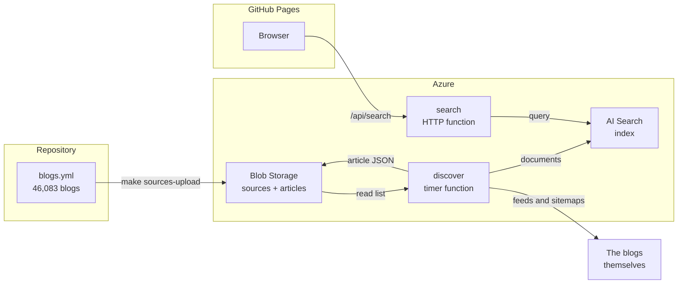
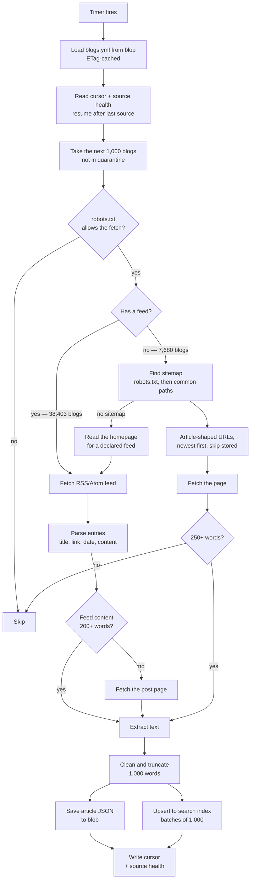
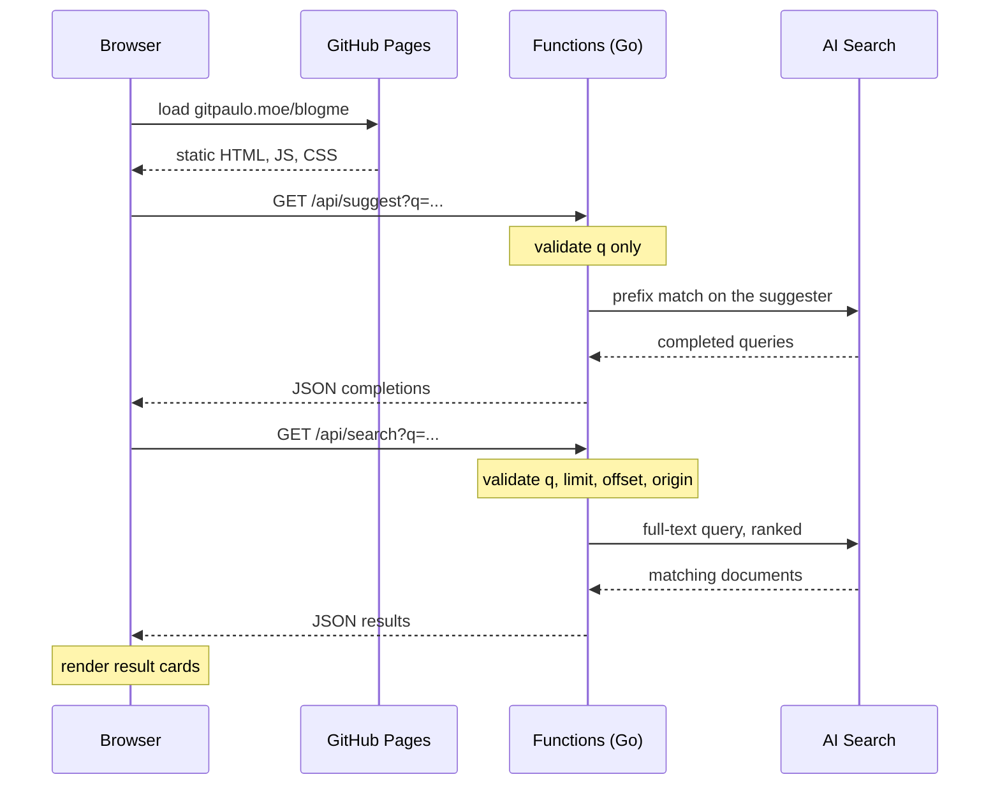
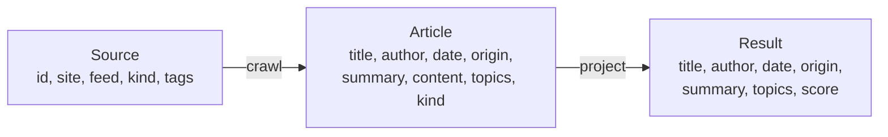
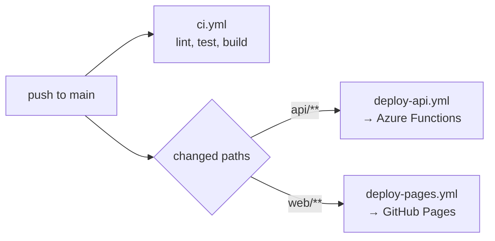

# How It Works

An end-to-end walkthrough of blogme, from a list of blogs to a search result.

For the reasoning behind these choices see [system design](system-design.md),
[tech stack](tech-stack.md) and the [high-level plan](plans/blog-discovery-search-high-level-plan.md).

## Overview

There are two independent paths through the system. The **write path** fills the corpus
on a timer; the **read path** answers a user's query. They meet only at the search index.



The two paths are deliberately decoupled: discovery can fail entirely and search keeps
working against whatever is already indexed.

## Write path — filling the corpus

Runs on a timer. Each pass handles a slice of the source list and records where it
stopped, so no single run approaches the function timeout.



A feed describes its own posts, so it is both cheaper and more accurate: one request
usually yields every recent post, with a title, a link and a date already attached. The
sitemap path exists for the sixth of the corpus that publishes no feed. It is slower by
design — a sitemap lists every page a site has, so each candidate must be fetched before
it can be judged, and the word count is what separates a post from a landing page. Which
path found an article is recorded on it as its **origin**, because sitemap metadata is
the less dependable of the two and the UI says so.

A blog with neither is read by neither path, so before giving up the crawler reads the
homepage and uses a feed the page advertises. That is a repair, not a route: it means
the source list is missing a feed the blog has been publishing all along, and the
durable fix is [`blogs-overrides.yml`](../sources/README.md#corrections-by-hand).

When every route fails three passes running, the source is set aside and probed weekly
instead of hourly — about a tenth of the list, and almost all of it entries that never
worked rather than blogs that stopped. See
[quarantine](discovery-cadence.md#quarantine).

Key properties:

| Property        | How                                                                       |
| --------------- | ------------------------------------------------------------------------- |
| Bounded runtime | Fixed batch of blogs per run, never the whole list                        |
| Resumable       | Cursor stores the last source **ID**, so it survives list regeneration    |
| Polite          | robots.txt respected; concurrency capped per registrable domain           |
| Idempotent      | Article IDs are the source plus a hash of the URL, so re-crawling updates |
| Incremental     | Sitemap pages already stored are skipped, so later runs reach deeper      |
| Fault isolated  | One failing blog is logged and skipped; the pass continues                |
| Self-pruning    | A source that fails every route repeatedly stops costing a full crawl     |

The per-domain cap matters more than it looks: shared platforms host thousands of the
sources, with `bearblog.dev` alone accounting for over a thousand. Limiting by hostname
would not help, because each blog is its own subdomain of the same server.

Idempotent within a source, that is, and the qualifier is the interesting part. Because
the id carries the source, one article reachable from two of them is two documents —
two blobs, two index entries, two rows competing for a page. That happens whenever the
list holds a site twice, or an aggregator republishes somebody else's post: searching
"claude" returned twenty rows of which seventeen were distinct, three of them repeats of
the same two articles. So duplicates are removed at three points, and each one covers
something the others cannot see:

| Where            | Removes                                           |
| ---------------- | ------------------------------------------------- |
| Source list      | Platform roots that shadow the writers beneath    |
| API, per page    | A URL already used by an earlier row on that page |
| Browser, on load | A URL already on screen from an earlier page      |

The source list is the only place that can stop the duplicate being crawled at all; the
API is the only place that sees a whole page before anyone renders it; and the browser is
the only one that can see across pages. Removing the cause upstream does not retire the
guards downstream, because the list is rebuilt from other people's lists and will always
find new ways to name the same blog twice.

## Read path — answering a query



The site is static and holds no credentials. The function app authenticates to Azure
with a managed identity, so no keys exist in the browser or in the repository.

Every query parameter is validated before it reaches the index, and the one filter the
API offers — `origin`, which narrows results to feed or sitemap discoveries — is built
from a fixed set of expressions rather than from the caller's string, so no filter can be
injected through the query.

### Rate limits

The endpoint is anonymous, so there is no key to revoke and a **rate limit** is what
stands between a script and the bill. Callers are identified by the address Azure appends
to `X-Forwarded-For`, and a throttled request is answered with `429`, `Retry-After` and
the `RateLimit-*` headers. Semantic queries carry a second, tighter allowance — per caller
and across the service — because reranking spends from a metered monthly quota rather than
from capacity that renews by the minute.

| Setting                              | Default | Applies to             |
| ------------------------------------ | ------- | ---------------------- |
| `BLOGME_SEARCH_RATE_PER_MINUTE`      | 60      | One caller, any search |
| `BLOGME_SEARCH_RATE_BURST`           | 60      | One caller, any search |
| `BLOGME_SEARCH_RATE_ALL_PER_MINUTE`  | 600     | Everyone, any search   |
| `BLOGME_SEARCH_RATE_ALL_BURST`       | 300     | Everyone, any search   |
| `BLOGME_SEMANTIC_RATE_PER_MINUTE`    | 10      | One caller, semantic   |
| `BLOGME_SEMANTIC_RATE_BURST`         | 5       | One caller, semantic   |
| `BLOGME_SEMANTIC_RATE_PER_HOUR`      | 60      | Everyone, semantic     |
| `BLOGME_SEMANTIC_RATE_HOUR_BURST`    | 15      | Everyone, semantic     |
| `BLOGME_SUGGEST_RATE_PER_MINUTE`     | 240     | One caller, typeahead  |
| `BLOGME_SUGGEST_RATE_BURST`          | 60      | One caller, typeahead  |
| `BLOGME_SUGGEST_RATE_ALL_PER_MINUTE` | 1200    | Everyone, typeahead    |
| `BLOGME_SUGGEST_RATE_ALL_BURST`      | 600     | Everyone, typeahead    |

The burst is sized against the client's own fan-out rather than against someone typing:
one "load more" chases page after page while a filter hides what arrives, so a reader
who clicks twice in quick succession spends tens of requests in a few seconds.

These are per instance, and Flex Consumption scales out, so they bound the blast radius
rather than enforce a budget: they turn "burn the month's reranking in a minute" into
"burn it over many hours", which is long enough to notice. The service-wide limits are
what bound a flood, because traffic spread over many addresses is polite at every one
of them; the instance ceiling on the plan is what turns that bound into a number.

### At most three results from one blog

A page carries at most three results from any one blog. Three posts from one site is
rarely what a reader wanted, and it means a source that stuffs its posts with popular
terms takes three rows rather than the page.

That cap thins a page after the index has already ranked it, which is a more awkward
thing to do than it sounds, and two pieces of the design exist only to make it safe.

**More documents are read than the page holds** — three for every row. Reading exactly a
page's worth returns however many happen to survive: searching "claude" gave three rows
out of twenty, because its first twenty-nine matches were all the same site. The other
seventeen rows were never missing, they simply sat past where a page-sized read looks;
the same query yields 24 usable rows inside its first 50 documents. In semantic mode the
read stops at the reranked window instead, since filling a page from past it would be
keyword ordering wearing a semantic label.

**The API says where the next page starts**, in `nextOffset`, and clients must use it
instead of adding their own page size. A page of twenty rows is not twenty documents
wide once the cap has removed some, so a fixed stride steps over whatever was removed and
skips it for good rather than deferring it. This is what makes "load more" reach every
result exactly once.

### A query is text, not grammar

**What a reader types is treated as text, not as grammar.** Azure parses the search
string before any analyzer sees it, and the punctuation in the names of things collides
with that grammar: `+` is the AND operator, so `c++` is the letter c followed by two
operators, and c alone analyses to nothing.

It did not look broken, which is what made it worth finding. The parser dropped the term
and searched for whatever was left, and the result count stayed high enough to read as a
healthy search:

| you type        | you used to get                                         | you now get                                                        |
| --------------- | ------------------------------------------------------- | ------------------------------------------------------------------ |
| `c++`           | nothing, of 21,562 documents                            | 21,562, led by "C++ String Conversion: `std::from_chars`"          |
| `c++ templates` | 50,337, led by "Free Templates and Themes by WrapPixel" | 1,906, led by "C++ Templates: How to Iterate through `std::tuple`" |
| `modern c++`    | 94,512, led by "Modern Mythology \| RPGs"               | 3,162, led by "A long article about modern C++"                    |
| `google+`       | 128,138 about Google                                    | 2,353 about Google+                                                |
| `c*`            | 1,244,794 — every term starting with c                  | 0, which is what the literal string matches                        |

`escapeQuery` in [query.go](../api/internal/index/query.go) escapes every operator, and
the set it escapes is wider than the simple query type needs — the extra characters belong
to the full Lucene syntax this package does not use yet. Escaping a character the parser
ignores costs nothing, measured across 28 queries carrying punctuation from `c#` and
`node.js` to `127.0.0.1` and `ci/cd pipelines`, all of which returned identical counts
either way. A rule that only holds for the current `queryType` is a trap for whoever
changes it.

One piece of grammar survives: a **balanced pair of double quotes**. Wrapping words to
mean "these words, in this order" is a convention people arrive already knowing, and the
service honours it — `"rust ownership"` returns 161 results against 1,192 loose. A lone
quote is an apostrophe or a typo rather than an instruction, so it is escaped with
everything else. Nothing else is preserved: a leading `-` excluded a word and `c*` matched
a million documents, and neither is something this search box offers or explains.

### Which fields a query reaches

**A query is matched against named fields only**, listed in `searchFields`, and leaving
that to the default was a real bug for a while. The default is every field marked
searchable, and those fields are not analysed alike: `title`, `summary`, `content` and
`authorText` declare `en.microsoft`, which discards English stopwords, while `author` and
`topics` were created without an analyzer at all and keep them. So `a tour of go` reaches
the first group as `[tour, go]` and the second as `[a, tour, of, go]`.

Under `searchMode: all` that is not a nuance, it is the query. Every term has to match
somewhere, so "a" and "of" — held now only by the unanalysed fields — could be satisfied
only by a document whose author name or topic slug contained them. Adding fields made the
answer smaller and wrong:

| query                      | all searchable fields                  | named fields                                       |
| -------------------------- | -------------------------------------- | -------------------------------------------------- |
| `a tour of go`             | 24, all bylines                        | 11,508, headed by "An interactive tour of Go 1.27" |
| `the pragmatic programmer` | 32, headed by "The Healthy Programmer" | 819, headed by "The Pragmatic Programmer"          |
| `history of the internet`  | 203, headed by "powerless trio"        | 10,180, headed by "Internet History: Next Steps"   |
| `rust ownership`           | 1,275                                  | 1,180, same top row                                |

Every query on record that contained an English function word was affected, and none that
did not. The fix is to name only fields that analyse the query the same way. `author`
cannot be given an analyzer — the service answers "Existing field 'author' cannot be
changed", and rebuilding the index to fix a field would empty every quality score with it
— so `authorText` is a copy of it under `en.microsoft`, in the same way and for a
relatable reason to `titleSuggest`. Searching by name needs it: text alone finds 3 of one
author's 258 posts, because the other 255 never print his name in the body. `topics` is
left out rather than copied, being a closed vocabulary of slugs that `content` already
carries; across the query set it added between 21 and 95 documents and never once changed
a top three. `TestEverySearchableFieldDeclaresAnAnalyzer` is what keeps a third such field
from arriving unnoticed.

### Every word, then any of them

A search matches only documents containing **every** word of the query. Matching any of
them was the original choice, meant to hand the reranker a wide field to sort out, and
measured against the queries people actually type it was the wrong trade: "ai text
watermarks" reported 185,796 matches, of which 265 held all three words and the rest
merely said "text". Requiring all of them put "How AI text watermarking works" first and
moved a search for "sean goedecke" from rank 39 to 14 among his own posts, while leaving
the top of "github actions" — the most searched query here — untouched. Every query on
record still returns something.

When nothing matches every word, the search asks again for any of them, and says so.
What is left for that retry is the query where every word is real and no single article
carries them all — a long phrase, or a spelling the corpus writes another way. It runs
only on an empty page, so no search that works is touched, and only on a query of more
than one word, where "all" and "any" are different questions. A page that came back this
way is flagged `broadened` and the result count says "nothing matched every word, so
these match any of them" — the reader can see what they typed, and rows answering a
looser question should not arrive unannounced.

### Ranking

Ranking happens in two stages. Keyword scoring picks the candidates, weighted towards the
title, and then Azure AI Search's **semantic ranker** reorders them with a language model
— which is what makes a query phrased as a sentence work rather than only a bag of
keywords. The reranker only reaches the top 50 keyword matches, so that window is also
the entire result set the API offers: past it, ordering would quietly revert to keyword
scoring part-way down a scroll. Reranking is metered, so a query is downgraded to keyword
ranking when the throttle says the budget is spent, and retried without it if the service
refuses anyway. Search degrades rather than failing, either way.

No query names a scoring profile, and one applies anyway: an index's
`defaultScoringProfile` is used by every query that does not choose one. Naming it
explicitly was measured against `claude`, `rust ownership`, `sean goedecke`,
`github actions` and `python` and returned byte-identical results every time — both arms
of that comparison were already running the same profile.

That is the hook the whole of [quality-scoring.md](quality-scoring.md) hangs on: a
scoring **function** added to the default profile reaches every query without a line of
code changing. The index carries four profiles differing from each other by one variable
at a time — `relevance-quality` is the current default — so which should apply is a
question `make harness` can answer rather than one to argue about.

### Choosing a mode

Two ranking modes is one more than most search boxes have, so the toggle teaches rather
than labels: hovering it says what that mode matches on, what it is good for, and two
queries worth trying, with semantic's shallower paging spelled out. The button's own
`aria-label` carries the same thing in one sentence, because a tooltip is not reachable by
every reader.

The box also offers the other mode when a query reads like a question — "why is my
postgres slow" — as a row under the search box with a **Try it** and a dismissal, never by
switching modes underneath somebody. The test for a question is deliberately hard to pass:
a trailing question mark, or an opening pair like "why is", "how do", "can i". Both halves
of the pair are required, and that is the whole design — "how" alone opens "how I built my
blog", which is a title a keyword search finds exactly. An offer that appears over
ordinary searches is worse than none, because it teaches people to ignore it.

### The search lives in the URL

A search lives in the address bar. The query and the ranking mode — everything the server
was asked for — are written back as `?q=` and `?mode=`, so a search can be shared,
reloaded or returned to. The remaining filters narrow the rows
already fetched rather than the query behind them, and a fresh search clears them, so they
stay out. The URL is written once per search rather than once per keystroke: partly
because it should describe results that exist, and partly because browsers throttle
history writes.

A link carrying a search does not take the caret. The bare page is a search box with a
page around it, so the caret starts in it; a link with `?q=` is a result set someone has
been sent to read, and focusing the box on arrival would open the suggestion list over the
results they came for, offering completions for a query they never typed. The list appears
when they go to the box, which is when they have asked for it. A link with other
parameters and no `q` still focuses, because there is nothing to read yet.

### Caching and compression

An answer is cacheable for two minutes, so a reload or a shared link opened twice costs
neither an execution nor an index query. Discovery runs hourly, so anything well inside
that cycle serves the corpus the index would have answered from anyway; a minute was
short enough to expire between a reader opening a result and coming back for the next
one. Only the answer is cached: an error describes this moment rather than the query,
and caching one would go on serving a failure the service had already recovered from.

Answers are gzipped when the caller says it can read them. A page of results is 10–18 KB
of JSON that compresses to 36–45% of that, for about 0.3 ms against a search whose median
is 31 ms — nearly all of what a reader waits for is the body crossing the network rather
than the search itself. The Functions host proxies the response back untouched, so this
happens in the worker or not at all. Bodies below 1 KB are sent as they are, because gzip
costs eighteen bytes of header and footer before any content and every error here is one
sentence. `Vary: Accept-Encoding` rides on both forms, since they share a URL and the
answer is cacheable and public.

### Typeahead

`/api/suggest` completes the query being typed. It is the **autocomplete** half of Azure
AI Search's typeahead rather than the **suggest** half, which returns documents: the page
already searches on a pause in typing and renders titles live, so a dropdown of documents
would duplicate the result list directly underneath it. What the box could not do before
is say what is in the corpus, and that is what a completion is for. Each one is a whole
query rather than the word that finishes it, because a list reading "query, queue,
quantum" under a box saying "postgres qu" does not tell a reader what they are about to
search for.

Half of what the suggester offers is thrown away before a reader sees it, and that is
the difference between a useful list and a distracting one. It extends a query by one
whole term and has no notion of which terms are worth extending it by, so asked for eight
completions of "rust" it answers "rust and", "rust for", "rust in", "rust 1". Measured
across fourteen prefixes on the live index, **53% of the rows it offers are of that
kind**. So the request reads five times as many as it needs — forty completions cost a
median 157 ms against 173 ms for eight, because the work is finding the prefix rather
than returning the rows — and drops any whose added words are function words or bare
numbers, along with plurals of a completion already in the list. `make suggest-harness`
prints the before and the after for a fixed set of prefixes, which is how that figure is
arrived at and how a change to it can be judged.

There is a second thing filtering could not fix, and it was worse than junk. The service
finishes the last word of a query and **echoes everything before it back unchecked**, so
asked to complete "minecraft world gen" it answered "minecraft world gen z" and "minecraft
world generation rag" — and answered the same shape to "zzzqqq world gen", because
"minecraft world" constrained nothing. Those read as phrases somebody wrote and are not:
searching for "minecraft world gen z" finds nothing at all.

So how the query is completed depends on how much of it there is. **One word** has nothing
in front of it to echo, so the pair the service offers is a real one and it may add a whole
word: "minecraft" becomes "minecraft server". **More than one** and only the word being
typed may be finished — "minecraft world gen" becomes "minecraft world generation" and
"minecraft world generator", never something invented after it. The proof the rule rests on
is that "zzzqqq" alone completes to nothing, where "zzzqqq world gen" cheerfully completes
to five things.

Finishing a word is not always wanted either. Where the word being typed is a function
word, growing it produces "how tokyo" from "how to" and "why island" from "why is";
somebody who typed "to" meant "to". Those are dropped by the same list that stops a
completion _adding_ a function word, and the query falls back to the titles beneath it.

Filtering could not fix the ordering, though. The service returns completions
alphabetically within a prefix rather than by how often a phrase occurs, so "go conc"
offered "go concept art" and never "go concurrency" — and nothing downstream can rank
terms that arrive without a score. That is why a suggestion is drawn from **two sources
at once**.

The second is the **suggest** API against the same suggester, which returns matching
documents rather than assembled terms — and documents are scored, so "go conc" answers
"Learning Go: Concurrency Patterns using errgroup package". The two cover each other's
failure. Titles are ranked but only exist where the whole input appears in a headline, so
"why is my postgres" finds none; completions are unranked but never come back empty. Both
are asked at once rather than one after the other, because in sequence the wall clock is
the sum and, worse, a fallback would spend its second round trip on exactly the queries
the first source could not serve. One source failing is a shorter list; only both failing
is a failed request.

Titles take at most three of the eight rows and go first, because ranked beats
alphabetical and because eight article titles is a worse search box than one that also
offers "rust compiler". Three further rules came out of running the harness against the
real corpus rather than from taste: at most **one title per blog**, after "how to" filled
every row with consecutive posts from a single accessibility series; nothing longer than
seventy characters, after a title arrived that was a paragraph; and, where the query is in
Latin script, titles in Latin script only. That last one is a judgement call worth naming
— the corpus is multilingual by design and search still returns all of it — but asked to
complete "python" the index offered three Chinese titles to a reader typing in English,
which spent every ranked row it had.

Completions come from a **suggester**, which is an extra tokenisation of one field: the
titles are indexed again as prefixes, so "kubernetes" is also stored as "kub", "kube",
"kuber" and so on. That field is `titleSuggest`, a copy of `title`, and the copy is not an
oversight — Azure AI Search refuses to add an existing field to a suggester, because
prefixes are generated during indexing and an existing field is already tokenised. A
suggester on `title` itself would have meant dropping and rebuilding the index, which also
empties every quality score and costs days of degraded ranking to refill. A new field
alongside it costs about 0.8 KB per document, no downtime, and no rebuild.

Discovery writes `titleSuggest` for everything it indexes from now on, so only the
documents that predate the field need filling in. That is what
[`infra/backfill-suggest.sh`](../infra/backfill-suggest.sh) does, and it keeps no cursor:
a document leaves the set below the current `suggestVersion` by being written, so reading
the head of that set repeatedly walks the corpus and then stops. The run is interruptible
and re-runnable for the same reason, and it never has to page past the `$skip` ceiling of
100,000.

`authorText` rides the same machinery, which is what the version number is for: raising
it makes every document eligible again, and one pass writes both copies. Version 1 wrote
`titleSuggest` alone; version 2 adds `authorText`. Until a document is reached it is
searchable by every word except its author's name, so the backfill wants running before
the field set that depends on it ships.

Typeahead is where an anonymous endpoint is easiest to abuse, so `q` is the only thing
read from the request. How many completions come back, which suggester answers, and
whether matching is fuzzy are all fixed in the code: a caller sending `fuzzy=true` or
`top=100` gets the ordinary answer, because fuzzy matching measured four times the latency
of an exact one and nobody should be able to buy that with a query string. The allowance
is counted apart from search rather than shared with it — typeahead fires several times
per search by design, so one bucket would mean a reader typing one query tripped their own
limit for searching it — and it never touches the reranking budget, because nothing here
is metered. Completions are cacheable for an hour, against two minutes for a page of
results: prefixes are short and shared between readers, and the vocabulary of a million
titles does not turn over in an hour. Nothing is logged on the way through, only failures
and only in bounded form; the platform already counts invocations per function, so paying
for a log line per keystroke would buy nothing.

The browser does its share. It waits out a pause of half a second before asking, holds the
answers to the last hundred queries, and asks nothing at all below three characters — so a
phrase typed straight through costs one request, and backspacing over it costs none. That
pause is longer than the search's own, so on a query typed without stopping the results
arrive first and the completions settle after them. A query the reader has just accepted is
not completed back at them, which saves both a request and a dropdown reopening under the
cursor to offer the line already in the box.

The list also closes on its own five seconds after the reader stops touching it, and says
so while it waits: the bottom edge of the box drains from full width to nothing over those
five seconds. Every keystroke and every row the pointer passes over starts it again, so it
only ever expires on someone who has moved on — at which point a suggestion list is an
interruption nobody has dismissed, sitting over the results. The bar is a scale transform
rather than a width, so the frames it draws cost no layout, and it is a countdown of its
own rather than the end of that animation: a reader who has asked for less motion gets no
bar, and the list still has to close for them.

The top of that dropdown is the reader's own. Up to two **recent searches** matching what
has been typed sit above the completions, most recent first, each marked with a clock
where a completion carries a magnifier. They are kept in `localStorage` — at most
twenty-five queries, forgotten after a month — and never leave the browser, which is also
why they can be matched below the three-character floor the index is asked about: the
lookup is free. Matching is on word boundaries, so "own" finds "rust ownership rules" and
"ust" finds nothing. A search is remembered when the reader commits to it — submitting it,
taking a suggestion, or opening one of its results — rather than on every keystroke the
debounced search runs, which would fill the history with the prefixes typed on the way to
a real query.

The list itself is the [ARIA combobox
pattern](https://www.w3.org/WAI/ARIA/apg/patterns/combobox/): the box is a `combobox` that
owns the caret throughout, and the highlighted row is named by `aria-activedescendant`
rather than focused. It is positioned absolutely, so opening it moves nothing on the page
behind it, and it is capped at 60% of the window's height and tied to the width of the box
above it, so it can neither run off a short screen nor push a long completion past the
edge of a narrow one. Each row shows the part of it the reader has already typed in bold,
built as text segments rather than interpolated markup — the words come from indexed blog
titles, and highlighting untrusted text by assembling a string is exactly how that becomes
an injection.

Two smaller decisions are what stop it feeling jumpy. The highlighted row is remembered as
the suggestion itself rather than as a position, so completions arriving mid-keystroke
reorder the list without moving the selection onto a row the reader never chose — it
follows its own row, and lets go when that row stops being offered. And the store holds the
previous answer while the next is in flight, so the list does not empty and refill on every
letter; what keeps that honest is that a completion is dropped as soon as it no longer
matches what is in the box. Without it, a request that failed or timed out would leave the
last query's completions on screen for good, under a box that has since moved on.

### Health

`/api/health` asks the index for a document count rather than reporting that the process
is up. The deploy workflow gates on it, and the failures worth catching all authenticate
correctly — a role assignment that was never granted still issues a token, and a
misspelled index name is a valid request to somewhere that is not there. Both would ship
green and then fail every search. Counting is not a semantic query, so the check spends
nothing from the reranking quota.

## In the browser

Everything past the result list is the reader's own, kept on their device and never sent
anywhere. There is no account, so there is nothing to sign into and nothing to lose when
the API is down.

| Feature          | Kept in                  | Notes                                           |
| ---------------- | ------------------------ | ----------------------------------------------- |
| Bookmarks        | IndexedDB, keyed by URL  | Exported and imported as JSON, capped at 5,000  |
| Visited marks    | IndexedDB, keyed by hash | Capped at 250,000, trimmed oldest-first         |
| Recent searches  | `localStorage`           | 25 queries, forgotten after a month             |
| Theme            | `localStorage`           | Falls back to `prefers-color-scheme`            |
| Preview geometry | `localStorage`           | Where the reader last dragged the preview panel |

The filter bar — tags, date range, bookmarked-only, visited-only — reads from the first
two. Those two also need more explanation than a table cell holds.

**A visit is stored under a hash of the URL, a bookmark under the URL itself**, and the
difference is what a collision would cost. The URL is first reduced to the page it names
— fragment dropped, tracking parameters removed, remaining ones sorted, scheme and `www.`
and a trailing slash ignored — then hashed to eight bytes, which is what keeps a history
of hundreds of thousands of reads small enough for a phone and off disk in readable form.
cyrb53 collides about once in 300,000 histories at the cap, and the damage when it does
is one link wearing a mark it did not earn. A bookmark cannot afford that, so it is keyed
by its URL. Only the links currently on screen are ever looked up: a render asks about
the handful in front of the reader, and one microtask serves them all from one
transaction.

**Hovering a result opens the page itself in a panel**, after a dwell long enough that
running the pointer down the list never starts one. The frame is sandboxed and sent with
no referrer. Many sites refuse to be framed at all, and the crawler already knows which:
`framingDenied` is read from the page's own headers at discovery time and travels with
the result, so a refusal is a one-line message rather than a blank box that spends a load
finding out. A page nobody has checked is still tried — that is what every link did
before any of this existed.

## Logging

There is no logger to configure. The Functions Go worker installs one at import time:
its slog handler attaches `invocation_id`, `function_name` and `trigger_type` to every
record, and once the worker connects it sends them to the host over gRPC, which is what
puts them in Application Insights. HTTP handlers get this for free, because the
dispatcher hands the handler a request whose context carries the invocation.

Two rules follow, and the first one matters more than it looks:

- **Never call `slog.SetDefault`.** Installing a handler of our own replaces the SDK's,
  and records fall back to stderr without `invocation_id`. Nothing fails loudly; the logs
  simply stop being correlated.
  [`logging_test.go`](../api/internal/httpapi/logging_test.go) pins this.
- **Always use the `*Context` variants** — `slog.InfoContext(ctx, …)` — inside a request
  or a timer run. The plain `slog.Info` is right only at startup, where no invocation
  exists yet.

Levels carry a meaning worth keeping to:

| Level   | Means                                                           |
| ------- | --------------------------------------------------------------- |
| `Error` | We are broken and someone must look                             |
| `Warn`  | One input was bad, or a caller was refused; the run continued   |
| `Info`  | One line per unit of work — a search, a discovery pass, startup |
| `Debug` | Per-item detail, off by default                                 |

Field names are shared across packages so a query works everywhere: `duration_ms`,
`source_id`, `url`, `error`, `count`, `total`, `rank`, `kind`, `caller`.

Every search emits exactly one `search` record with the query, `count`, `total`, `rank`
and `duration_ms`. That one line is the difference between knowing search works and
assuming it: a corpus that has quietly stopped matching anything otherwise looks
identical to a quiet day. Queries are logged, capped at 128 characters and with control
characters folded to spaces so nothing in a query can forge a second log record. A
passing health check is deliberately not logged — it is polled, and one line per poll
would bury everything else — but a failing one is, because by then something is wrong
that nobody has noticed.

Turning on debug needs no redeploy. Add the app setting and restart:

```bash
az functionapp config appsettings set \
  --name <FUNCTION_APP> --resource-group <RESOURCE_GROUP> \
  --settings AzureFunctionsJobHost__logging__logLevel__default=Debug
```

The host pushes that threshold to the worker, which filters by category before anything
crosses the wire. Set it back to `Information` when finished — at `Debug` the discovery
job logs a line per source, which at 1,000 sources an hour is not something to leave on.

## Where each stage lives

| Stage                                       | Code                                                                                                 |
| ------------------------------------------- | ---------------------------------------------------------------------------------------------------- |
| Build the blog list                         | [`sources/tools/`](../sources/tools/)                                                                |
| Publish the list                            | [`infra/upload-sources.sh`](../infra/upload-sources.sh)                                              |
| Load and cache the list                     | [`api/internal/sources`](../api/internal/sources)                                                    |
| Batching and cursor                         | [`api/internal/discovery/discovery.go`](../api/internal/discovery/discovery.go)                      |
| Feeds, fetching, robots                     | [`api/internal/discovery`](../api/internal/discovery)                                                |
| Sitemap fallback                            | [`api/internal/discovery/sitemap.go`](../api/internal/discovery/sitemap.go)                          |
| Text extraction                             | [`api/internal/discovery/extract.go`](../api/internal/discovery/extract.go)                          |
| Canonical storage                           | [`api/internal/store`](../api/internal/store)                                                        |
| Index and query                             | [`api/internal/index`](../api/internal/index)                                                        |
| Typeahead                                   | [`api/internal/index/suggest.go`](../api/internal/index/suggest.go)                                  |
| Backfilling `titleSuggest` and `authorText` | [`infra/backfill-suggest.sh`](../infra/backfill-suggest.sh)                                          |
| HTTP handlers                               | [`api/internal/httpapi`](../api/internal/httpapi)                                                    |
| Web UI                                      | [`web/src`](../web/src)                                                                              |
| Bookmarks and visited marks                 | [`web/src/lib/bookmarks`](../web/src/lib/bookmarks), [`web/src/lib/visited`](../web/src/lib/visited) |
| Link preview                                | [`web/src/lib/components/LinkPreview.svelte`](../web/src/lib/components/LinkPreview.svelte)          |

## Data at each stage

One line of `blogs.yml` becomes many search results:



A source's `tags` describe the blog, so on their own every post from it would be labelled
identically. On the feed path the post's own categories are added to them, which is the
only per-post subject signal available without reading the post. `kind` travels
unchanged: it is a fact about the blog, not about any one article.

Blob storage holds the canonical `Article`. The search index is a **projection** of it and
is treated as disposable: it can be dropped and rebuilt from blob at any time, which is
why moving between search tiers is cheap.

## Deployment



Both deploy workflows authenticate to Azure with OIDC federation, so no long-lived
credential is stored in GitHub. Publishing a new blog list is separate from deployment:
`make sources-upload` is enough, and the running job picks it up on its next pass.
