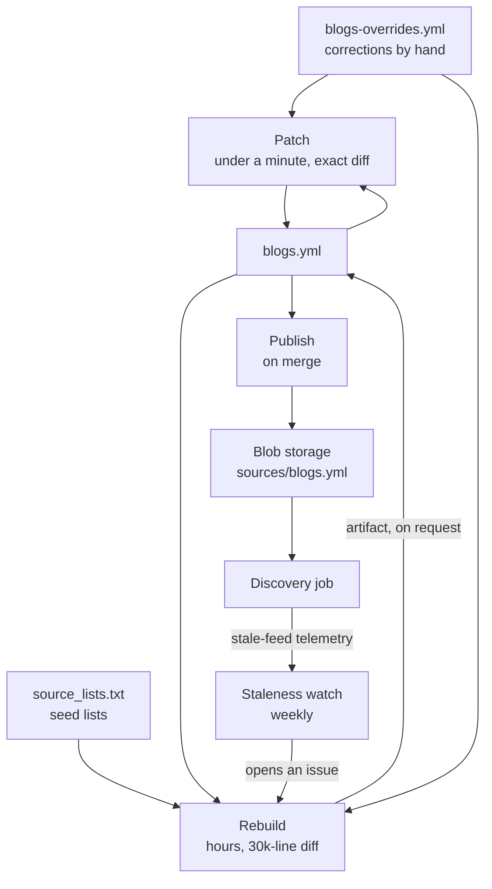
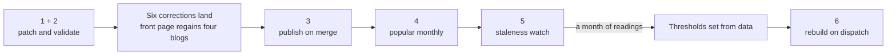

# Keeping the Curated Lists Current

> How `blogs.yml` and `popular.json` stay correct without anyone remembering to rebuild
> them, and why the answer is not a scheduled rebuild. Companion to
> [sources/README.md](../../sources/README.md), which owns the extractor, and to
> [popular-blogs-landing-plan.md](popular-blogs-landing-plan.md), which owns the list on
> the front page.

## What this covers

Three files are generated and committed. Until items 1 and 2 below, nothing watched any
of them; two are now on a schedule and the third is the one that cannot be.

| File                                                        | Size            | Built by         | Last built                    |
| ----------------------------------------------------------- | --------------- | ---------------- | ----------------------------- |
| [`sources/blogs.yml`](../../sources/blogs.yml)              | 8.65 MB, 46,081 | `make sources`   | 21 Aug 2026 (`b4d92ab`)       |
| [`web/src/lib/data/popular.json`](../../web/src/lib/data/popular.json) | 1.8 KB, 12      | `make popular`   | weekly, as a pull request     |
| [`web/src/lib/data/trending.json`](../../web/src/lib/data/trending.json) | 0.8 KB, 4      | `make trending`  | daily, committed              |

They look alike — generated, committed, reviewed — and they are not. One takes two hours
and rewrites 30,000 lines; the other takes two minutes and rewrites six. Treating them
the same is what a cadence would do, and it is the mistake this plan exists to avoid.

## The problem, in one example

On 1 September four names were corrected in
[`blogs-overrides.yml`](../../sources/blogs-overrides.yml), because feed titles are not
names:

| Host             | What `blogs.yml` called it                   | What the override says |
| ---------------- | -------------------------------------------- | ---------------------- |
| `gwern.net`      | Essays                                       | Gwern Branwen          |
| `steveblank.com` | Comments for Steve Blank                     | Steve Blank            |
| `idiallo.com`    | Software and Tech stories from an Insider…   | iDiallo                |
| `overreacted.io` | overreacted — A blog by Dan Abramov          | overreacted            |

**None of them had been applied a day later.** Overrides are merged at the end of a
build, and there had been no build since 21 August. So all four were still rejected by
the landing page's name gate, and all four were missing from the twelve blogs the front
page offered. The same commit added `drop: true` for two `pubsubhubbub.appspot.com`
entries — a relay that answers to Tim Bray's feed title and is not a blog. Both were
still in `blogs.yml`, and therefore still being crawled.

The fixes were written down, reviewed and committed. They were not in effect, and nothing
said so.

That is the whole health problem, and it has a precise shape: **the rebuild was the only
tool, so every correction cost a rebuild.** A four-line name fix had to be delivered by
a two-hour run that re-derives 46,081 entries from scratch and churns thousands of
unrelated ones on the way past.

## Why a scheduled rebuild is the wrong answer

Measured across the last two consecutive rebuilds, one day apart:

| | 20 Aug | 21 Aug |
| --- | ---: | ---: |
| Sources | 47,102 | 46,084 |
| Feeds | 38,956 | 38,404 |

| Movement between them | |
| --- | ---: |
| Sites removed | 2,703 |
| Sites added | 1,685 |
| Sites unchanged | 44,399 |
| Feeds lost | 2,878 |
| Feeds gained | 2,326 |
| **Net** | **−1,018 sources, −552 feeds** |

About 30,000 changed lines to move the corpus by 2%, with feed preservation
(`known_feeds`) already in place — this is what a rebuild costs when it is working
correctly, not a bug it had. Four consequences follow, and each alone rules out a
schedule:

- **Nobody reviews 30,000 lines.** Review is the stated reason the list lives in Git at
  all. A weekly PR that is always rubber-stamped has removed the check while keeping the
  ceremony.
- **The removals are felt in production.** A dropped source stops being crawled; a lost
  feed falls to the sitemap path, and to nothing where there is no sitemap — the failure
  [discovery-cadence.md](../discovery-cadence.md) documents twice.
- **Datacenter IPs change the answer.** Reachability *is* the membership rule, and bot
  protection treats GitHub's egress ranges differently from a home connection. Unmeasured.
- **`GITHUB_TOKEN` truncates the harvest silently.** It allows 1,000 requests an hour per
  repository; the harvest reads at least 1,321 distinct list files plus tree and branch
  calls. [`_get`](../../sources/tools/extractor/sourcelists.py) retries four times over
  about seven seconds against a reset window of up to an hour, then raises — and the
  failure is swallowed per file and per repository, leaving a `warning:` line in a log
  nobody reads. The run succeeds. The list is missing whole seed lists.

Minutes are not the constraint. The repository is public, so standard runners are free
and unlimited, and the only hard ceiling is six hours per job — which a rebuild fits,
at an estimated 1.5–2.5 hours on the 4-vCPU runner a public repository gets.

## The shape of the fix

Split the one operation into three, so each can run at the cadence it deserves.

| Operation   | Answers                            | Costs             | Cadence               |
| ----------- | ---------------------------------- | ----------------- | --------------------- |
| **Patch**   | is the list *correct*              | ~50s, no network  | every override change |
| **Rebuild** | are there blogs we do not have     | hours, 30k lines  | on evidence, by hand  |
| **Publish** | is production *running* the list   | seconds           | on merge              |

Today only Rebuild exists, which is why it gets asked questions it is far too expensive
to answer.

## Work

Ordered by value over cost. Items 1–3 are the ones that make the system healthy; 4–6
keep it that way.

**Items 1 and 2 are done.** `make sources-patch` applies the corrections and `make check`
verifies they have been, in CI. The six that were stuck have landed: four names and the
two `pubsubhubbub.appspot.com` entries, leaving 46,081 sources. Everything below item 2
is still to do.

### 1. `make sources-patch` — apply overrides without rebuilding

The architectural fix, and the smallest change here.
[`apply_overrides`](../../sources/tools/extractor/overrides.py) already operates on plain
entry dicts, which is exactly what `yaml.safe_load(blogs.yml)["sources"]` yields, and
`validate_entries` and `write_sources_yaml` take the same shape. So a patch-only path is
load, apply, validate, write — perhaps thirty lines and a CLI, reusing every existing
function and needing no network, no token and no venv beyond PyYAML.

What it buys: a name fix becomes a four-line diff, reviewable at a glance, delivered in
about a minute — almost all of it PyYAML parsing and re-rendering the 8.6 MB file, since
the merge itself is trivial. The six corrections sitting unapplied since 1 September
land immediately.

Run it in CI too, on every PR touching either file, asserting the working tree is
unchanged afterwards — so `blogs.yml` and `blogs-overrides.yml` cannot silently disagree
again.

**Files:** `sources/tools/patch_sources.py`, `Makefile`, `.github/workflows/ci.yml`

### 2. Validate overrides against the committed list

Falls out of item 1 almost free, and is worth naming separately because it catches a
different failure. An override is matched by exact `site:` string; a mistyped one that
carries `name` and `tags` becomes a new and largely empty source, and one that does not
can only report itself as unmatched — during a build, which is to say roughly never.

The check is: every override's `site` matches an entry in the committed `blogs.yml`, or
carries enough to stand alone deliberately. Seconds, no credentials, on every PR.

**Files:** folded into item 1's CI step

### 3. Publish on merge

Merging a change to `blogs.yml` currently changes nothing in production. The discovery
job reads the blob, and the blob is only written by someone running `make sources-upload`
from a laptop. Nothing compares the two, so the list in Git and the list being crawled
can diverge indefinitely and look fine.

A workflow on push to `main`, path-filtered to `sources/blogs.yml`, running the existing
[`upload-sources.sh`](../../infra/upload-sources.sh) — which already sanity-checks the
file and verifies the uploaded size. The script is the reviewed part; the workflow only
decides when it runs.

**Needs a role.** [`github-oidc.sh`](../../infra/github-oidc.sh) grants `Contributor` on
the resource group, which is control plane only. Blob writes under `--auth-mode login`
need `Storage Blob Data Contributor` on the storage account. Add it there, so a rebuilt
environment comes up with it.

**Files:** `.github/workflows/publish-sources.yml`, `infra/github-oidc.sh`

### 4. Refresh `popular.json` weekly, as a PR ~ done

The cheap half of the original question, and the one where the answer is yes.
`make popular` is a blob download, a YAML read and a dozen Search count queries — about
two minutes, a diff of one row per blog, and because the file lives under `web/` a merge already
triggers [`deploy-pages.yml`](../../.github/workflows/deploy-pages.yml).

There is a live reason to schedule it now rather than later. The sweep only stopped
recording failed lookups as zeroes on 1 September (`aa10344`), and
[popularity.md](../popularity.md) puts true coverage nearer 53% than the 21% currently
recorded. The ranking behind the front page is still converging, so it will genuinely
move over the coming weeks — the one period where a scheduled refresh earns its keep.

Three details that matter:

- **A PR, not a push.** The landing page is an editorial surface with a name gate; a bot
  committing to `main` gives up the review for nothing.
- **Also on push to `sources/blogs.yml`.** The `corpus` figure and the name gate both
  read the source list, so a patch or a rebuild should refresh the six.
- **Fail without a search key, do not warn.**
  [`build_popular.py`](../../sources/tools/build_popular.py) skips the `MIN_ARTICLES`
  check when no endpoint is given and prints a warning. In a scheduled run nobody reads
  that warning, and the result is a front page offering blogs that open onto nothing —
  the exact failure `utcc.utoronto.ca` was found to cause. Unattended, it must be an
  error.

**Files:** `.github/workflows/refresh-popular.yml`, `infra/ci/refresh-popular.sh`, `infra/ci/open-popular-pr.sh`, `sources/tools/build_popular.py`

**Built.** Weekly rather than monthly, and also on a push touching `blogs.yml`. The
generator now refuses instead of warning on every degraded path - no key, a truncated
`popularity.json`, an unreachable index, a list it could not fill - so a scheduled run
either produces six blogs or fails without touching the committed file. Each run opens
`chore(popular): refresh widely shared blogs (<date>)` and closes the last one as
superseded, so at most one is ever waiting. The two steps that do the work are
scripts under `infra/ci`, so they read and run outside Actions; the workflow holds
only the schedule, the credentials and the permissions, and `make popular` now calls
the same script rather than repeating its `az` incantations.

### 5. Watch staleness, and let it call for a rebuild

This is what replaces a cadence. The question a schedule is trying to answer — *is the
source list drifting away from reality?* — is one production already answers every hour:

| Signal                             | Where                                                     | Means                                         |
| ---------------------------------- | --------------------------------------------------------- | --------------------------------------------- |
| `quarantined` on the pass line     | [discovery.go](../../api/internal/discovery/discovery.go) | How much of the list has stopped answering    |
| `recovered feed from site html`    | [crawl.go](../../api/internal/discovery/crawl.go)         | The list's feed is wrong; the site's is right |
| `parse feed` / `fetch feed` errors | [crawl.go](../../api/internal/discovery/crawl.go)         | A recorded feed has gone stale                |

The first of those is new, and it is the one to build on. Quarantine was added to stop
re-crawling sources that never answer, so the count it reports every hour is already the
number this item wants: a direct measure of how far the list has drifted from the web it
describes, maintained by the crawler as a side effect of not wasting its time.

The other two say *why*, and [discovery-cadence.md](../discovery-cadence.md) measures them
at 125 `fetch feed` and 79 `parse feed` failures over one day in September 2026. It also
says in as many words that a run of recovery lines "means the source list is out of date,
not that the crawler is healthy". Nothing acts on any of it today.

A weekly workflow querying the Log Analytics workspace for those counts, opening or
updating a single issue when they cross a threshold. Seconds of compute, no new
credential beyond the login item 3 already needs, and it converts "rebuild every few
weeks and hope" into a rebuild triggered by evidence.

Set the thresholds from the first month of readings rather than guessing them now — and
treat an empty result as *unknown*, never as *healthy*, for the reason
[discovery-cadence.md](../discovery-cadence.md) gives at length: a rule that reads no rows
as good news is watching Azure Monitor rather than blogme.

**Files:** `.github/workflows/watch-source-staleness.yml`

### 6. Rebuild on dispatch, never on a schedule

Keep [`build-sources.workflow.yml`](../../sources/tools/build-sources.workflow.yml), drop
its `schedule:` trigger, and fix the two things that would make its first real run
misleading:

- **A PAT or GitHub App token, not `secrets.GITHUB_TOKEN`.** 5,000 requests an hour
  against 1,000. Until this changes the workflow produces a quietly truncated list.
- **A diff summary in the job output.** The reason a rebuild is frightening is that its
  diff is unreadable. Sources added, sources removed, feeds lost, feeds gained, and the
  twenty removals with the highest standing in `popularity.json` — the same arithmetic
  used in the table above, printed to the step summary. That is two minutes of review
  instead of none, and it is the difference between a rebuild being reviewable and being
  waved through.

Before its output is trusted, measure the thing nobody has: run once with
`--limit-candidates 2000` on a runner and once locally over the same slice, and compare
sources kept and feeds found. If the runner is materially worse, rebuilds stay on a home
connection and the workflow is only ever a convenience.

**Files:** `.github/workflows/build-sources.yml`, `sources/tools/build_sources.py`

## The system, once it is all in place

| Trigger                     | What runs               | Cost      | Reviewed |
| --------------------------- | ----------------------- | --------- | -------- |
| PR touching either list     | patch + override checks | ~50s      | n/a      |
| Merge to `sources/blogs.yml`| publish, refresh popular| ~2 min    | already  |
| Monthly                     | refresh popular         | ~2 min    | PR       |
| Weekly                      | staleness watch         | seconds   | issue    |
| A staleness issue           | rebuild, by hand        | 1.5–2.5 h | PR + summary |
| Never                       | scheduled rebuild       | —         | —        |

Every recurring job is seconds to minutes. The only expensive operation stays behind a
human decision, and now there is something telling that human when to make it.

## Cost

Nothing recurring in money. Standard runners are free and unlimited on a public
repository; the Azure side is one blob read and one blob write per publish, a dozen
Search count queries a month, and one Log Analytics query a week — all far below the
noise floor of the £55/month infrastructure. What the plan spends is two role
assignments and one credential:

| | |
| --- | --- |
| `Storage Blob Data Contributor` | on the storage account, for publish (item 3) |
| `Storage Blob Data Reader` | subsumed by the above, for `popular` (item 4) |
| A PAT or GitHub App token | only for item 6, only when a rebuild is run in CI |

The PAT is the only thing here that has to be rotated, and it is attached to the one
workflow that never runs on a schedule.

## Deliberately left out

- **A scheduled rebuild.** The subject of this plan. Available on dispatch; triggered by
  item 5.
- **Feeding crawler knowledge back into `blogs.yml` automatically.** The tempting version
  of item 5: the discovery job knows which recorded feeds are wrong and what the right
  ones are, so it could write corrections rather than merely counting them. It is the
  right long-term shape and it is not worth building yet — the crawler already routes
  around every one of these cases at runtime, so the cost today is invisibility rather
  than breakage. Build it when the staleness watch shows the counts climbing across
  rebuilds rather than being reset by them.
- **Auto-merging the `popular.json` PR.** The diff is one row per blog precisely so that
  someone reads it.
- **A self-hosted runner for the rebuild.** Would settle the datacenter-IP question by
  avoiding it, and costs a machine to maintain. Measure first (item 6); most likely the
  answer is that rebuilds simply stay local, which costs nothing.
- **Committing `link-audit.csv`.** 3.3 MB per rebuild for a file whose entire purpose is
  answering "why is this blog missing?" in the hours after a run. It is already uploaded
  as an artifact, which is where a debugging aid with a short half-life belongs.

## Sequencing

Items 1 and 2 first, alone, and not because they are easiest: they are the only ones that
fix something currently broken. Six corrections are sitting unapplied, four blogs are
missing from the front page, and two non-blogs are being crawled.

Item 3 next, because after item 1 there will be more merges to `blogs.yml` than there
have ever been, and each one that is not published widens the gap between the list in Git
and the list being crawled. Items 4 and 5 can go in either order. Item 6 last, and only
after item 5 has produced a month of readings — otherwise the rebuild has no evidence to
answer to, which is where this started.
