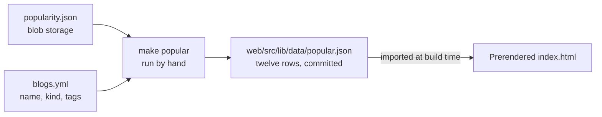
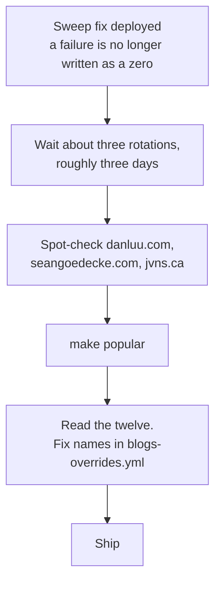

# Popular Blogs on the Landing Page

> A plan for what sits below the search bar before anyone has searched. Companion to
> [quality-scoring.md](quality-scoring.md), which owns the figure this reads.

## The problem it solves

With no query in the box, [`+page.svelte`](../web/src/routes/+page.svelte) renders a
heading, a subtitle, a search field, and nothing else. `searchable` is false, so the
whole result view is gated out and the page is two lines of text on white.

That is a poor first screen for a corpus of 46,083 blogs. It says nothing about what is
in here, offers no way in that does not start with typing, and gives a reader who does
not already have a query no reason to believe the index is worth one.

A short list of blogs the corpus is proud of answers all three at once: it shows the
index is real, it names things people recognise, and every row is a search they did not
have to think of.

## What "popular" has to mean here

**Not our own statistics.** There are none, deliberately — the site sets no cookie, runs
no analytics and counts no clicks. Whatever this list is ranked by has to come from
outside.

The figure that already exists is `qPopularity`: Hacker News points per site, gathered by
the scoring timer into `popularity.json`. Ranking the corpus by it directly puts
`bbc.com`, `techcrunch.com`, `theguardian.com`, `youtube.com`, `arstechnica.com`,
`npr.org` and `latimes.com` in the first ten.

Every one of those is genuinely in `blogs.yml`, and every one of them is wrong for this
page. Hacker News points measure **news circulation**, and a search engine for
independent tech blogs whose front page opens with the BBC has argued against itself
above the fold.

The fix is already in the data. `blogs.yml` carries `kind`, and the mainstream entries
have none — they arrived from general link lists, not from blog lists. Requiring a
blog-ish kind, dropping a handful of platforms the extractor mis-kinds, and collapsing
duplicate hosts leaves **7,079 candidates** whose head reads:

```text
 1.  38038  Simon Willison's Weblog                  simonwillison.net
 2.  27116  Troy Hunt                                troyhunt.com
 3.  24423  Shkspr                                   shkspr.mobi
 4.  21962  tonsky.me                                tonsky.me
 5.  20713  Drew DeVault's blog                      drewdevault.com
 6.  20565  Fabien Sanglard                          fabiensanglard.net
 7.  17411  mtlynch.io                               mtlynch.io
 8.  16910  Idle Words                               idlewords.com
 9.  16648  Sean Goedecke                            seangoedecke.com
10.  16218  Schneier on Security                     schneier.com
11.  15435  Chris Siebenmann                         utcc.utoronto.ca
12.  15311  Martin Fowler                            martinfowler.com
```

Measured after the sweep fix had drained, which is what the sequencing section below is
about: before it, this list had none of these names on it and `seangoedecke.com` scored
zero.

That is the page. Some names still need fixing — see
[Names are a gate](#names-are-a-gate).

### What the ranking is honestly measuring

Lifetime accumulated Hacker News points for the host, log-scaled. Worth saying plainly in
the plan so nobody has to reverse-engineer it later:

- **It favours blogs that have been publishing for a long time.** A blog that started in
  2024 cannot out-total one that started in 2007. This list will be stable for years.
- **It is a floor, not a gradient**, above roughly 500 points — the same saturation
  [quality-scoring.md](quality-scoring.md) describes. For a list of twelve drawn from the
  very top, that does not bite.
- **It is a proxy for one audience.** Hacker News is where this corpus's readers
  circulate, which is the reason it was chosen, and it is still one room.

None of that makes it the wrong figure. It makes the label matter: the section should not
claim to know what is *popular*, only what has been *widely shared*.

## Where the data comes from

**Built into the page, not fetched from the API.**



The landing page is the most-requested page on the site and the one a reader waits on
before doing anything else. Serving this from a new `/api/popular` would put a Function
invocation, a blob read and a possible cold start in front of every first visit, to
deliver a list that changes about as often as the blogs themselves do.

Baking it in costs nothing at runtime: the JSON is imported as a module, Vite inlines it,
and `prerender = true` means it is already in the HTML that GitHub Pages serves. No
request, no spinner, no empty state before the empty state.

It also puts the list in Git, which is where this project keeps every other editorial
decision — the same argument [sources/README.md](../sources/README.md) makes for
`blogs.yml`: a change to what the front page recommends goes through review rather than
appearing from a job nobody watched.

Refreshing it is `make popular` and a commit, on whatever cadence feels right. Monthly is
more than enough for a list whose top has not moved in a decade.

### The generator

A script at `sources/tools/build_popular.py`, wired to a `popular` target in the Makefile
alongside `sources`. It reads `popularity.json` from blob storage and `blogs.yml` from
the repo, and writes `web/src/lib/data/popular.json`.

| Step   | Rule                                                                                       | Why                                                                                                                                       |
| ------ | ------------------------------------------------------------------------------------------ | ------------------------------------------------------------------------------------------------------------------------------------------ |
| Join   | `siteOf(site)` to a `popularity.json` entry                                                | The same exact-host key the scorer uses, for the same reason: `bearblog.dev` subdomains must not inherit each other's standing             |
| Filter | keep entries whose `kind` meets `personal-blogs`, `company-blogs`, `independent-web`, `small-web` | This is what excludes the newspapers, and it is corpus data rather than a hand-list                                                       |
| Deny   | drop a short list of hosts                                                                 | `web.archive.org`, `w3.org`, `youtube.com`, `linkedin.com`, `github.com`, `medium.com` — platforms the extractor mis-kinded. Kept short, and in the script where it is reviewable |
| Dedupe | one row per host, highest points                                                           | Several sources share a host: `bbc.com` appears twice, `tbray.org` twice                                                                  |
| Gate   | reject unusable names                                                                      | A bad name here is a bad search                                                                                                           |
| Take   | top twelve                                                                                 | See [How long the list is](#how-long-the-list-is)                                                                                         |

Output shape. One object per blog carrying nothing the page does not render, plus the
size of the corpus they were drawn from, so the "and N more" line cannot drift from it
the way a number pasted into the component would:

```json
{
	"corpus": 46083,
	"blogs": [{ "name": "Ken Shirriff's blog", "site": "https://www.righto.com/", "host": "righto.com" }]
}
```

Written with LF endings whatever the platform, because the repo is checked out LF and
Prettier rewrites the file otherwise — a generated list would then fail `pnpm lint`.

Points are deliberately **not** in the output. The page does not show a score, and
shipping one invites a future version to render it — which would turn a way in to the
corpus into a leaderboard, and put a number beside people's names that they did not ask
for and cannot move.

### Names are a gate

Names in `blogs.yml` come from feed titles, and feeds lie. In the current top twelve:

| Host             | `blogs.yml` name                          | Problem                                            |
| ---------------- | ----------------------------------------- | -------------------------------------------------- |
| `gwern.net`      | Essays                                    | A common word. As a query it matches half the corpus |
| `steveblank.com` | Comments for Steve Blank                  | The WordPress *comments* feed title                 |
| `idiallo.com`    | Software and Tech stories from an Insider | A tagline, not a name                               |

So the generator refuses a name that is a single dictionary word, that begins `Comments
for`, or that runs past about forty characters, and prints what it rejected. The fix goes
in [`blogs-overrides.yml`](../sources/blogs-overrides.yml), which already exists for
exactly this and survives a source rebuild. Rejected blogs fall out of the list until
someone names them, which is the right default: this page is an editorial surface, and a
blog nobody has bothered to name is not ready to be on it.

## The interface

### Placement

Inside `<main>`, after the search form and the `tooShort` hint, gated on `!searchable` so
it is present exactly when the result view is absent. The two never coexist and never
animate past each other.

### Shape

Not `Card`. The result list uses cards because a result has a title, a byline, a summary
and tags — four things that need a container to hold them together. A blog is a name and
a host. Twelve cards would outweigh the search box they sit under and make the landing
page look busier than a page of actual results.

A two-column grid of compact rows, one column below `sm`:

```text
┌─────────────────────────────┬─────────────────────────────┐
│ ▣  Ken Shirriff's blog      │ ▣  Rust Blog                │
│    righto.com               │    blog.rust-lang.org       │
├─────────────────────────────┼─────────────────────────────┤
│ ▣  <antirez>                │ ▣  Engineering at Meta      │
│    antirez.com              │    engineering.fb.com       │
└─────────────────────────────┴─────────────────────────────┘
```

Each row reuses the exact pairing the result card already uses for provenance —
[`SiteIcon`](../web/src/lib/components/SiteIcon.svelte) beside a host in `text-sm
text-gray-500 dark:text-gray-400` — so the landing page teaches the vocabulary the
results pages use rather than inventing a second one.

### Type and colour

The card runs on three steps: 18 for the title, 16 for the description, 14 for anything
that describes rather than is. This list belongs to the same scale and adds no fourth
step.

| Element         | Token                                                 | Note                                                                                            |
| --------------- | ----------------------------------------------------- | ------------------------------------------------------------------------------------------------ |
| Section heading | `text-sm font-medium text-gray-500 dark:text-gray-400` | A label for a region, not a page heading. An `h2`, so the outline stays `h1 → h2` as under results |
| Blog name       | `text-base font-medium text-gray-900 dark:text-white`  | The thing being recognised                                                                      |
| Host            | `text-sm text-gray-500 dark:text-gray-400`             | Identical to the card's site line                                                               |
| Icon            | `SiteIcon`, `h-4 w-4`                                  | Identical to the card's site line                                                               |

`gray-500` and not `gray-400`, for the reason already written into the byline: 400 on
white is 3:1, under AA for text this size.

### The row is a button

Clicking sets `query` to the blog's name. Nothing else — the debounce effect already
watches `query` and runs the search, which is the path
[`acceptSuggestion`](../web/src/routes/+page.svelte) takes, comment included: *"The search
needs no prompting."* Record it with `recent.record(name)` and return focus to the input,
exactly as accepting a suggestion does, so the two ways of starting a search behave
identically.

A `<button>`, not an `<a href>`. Sending a reader straight out to `righto.com` from a
search engine's front page gives up on the thing the page is for; searching the blog keeps
them in the corpus with twenty of its posts in front of them.

Interaction states follow the app's existing vocabulary:

- Hover: `hover:bg-gray-50 dark:hover:bg-gray-800`, `rounded-lg` to match `Card`.
- Focus: `focus-visible:outline-2 focus-visible:outline-offset-2 focus-visible:outline-primary-600`,
  the ring the ranking toggle, the semantic hint and every result link already wear.
- No hover underline. That is the link idiom here, and this is not a link.

### Motion: none

The list is in the prerendered HTML, so it is on screen at first paint. A fade-in would be
a flicker on every cold load, animating something that never arrived.

It leaves the instant a query is typed, and it leaves without a transition — the reason is
already written twice in this codebase: an outro holds the element in the document until
it finishes, and in a background tab, where frames are paused, that is until the reader
comes back. A list of blog recommendations sitting under a page of results is precisely
the failure that note describes.

### Accessibility

- `<section aria-labelledby>` tied to the heading, so the region is announced and
  skippable.
- `<ul>` and `<li>` around the buttons: twelve items announced as a list of twelve.
- The icon stays `aria-hidden`, as everywhere else — the host is written beside it.
- Nothing goes into the existing `role="status"` region. Clearing the box is the reader's
  own action and does not need narrating; twelve blog names read aloud on every clear
  would be noise.
- Grid order matches DOM order, so tab order reads left to right, top to bottom.

### How long the list is

Twelve. Two columns of six fills the space under the search box without pushing the page
into a scroll on a laptop, and it is enough names for one of them to be recognised.

Twelve is also a budget. Each row asks a third party for a favicon, from that blog's own
origin — the trade [`site.ts`](../web/src/lib/site.ts) already priced and accepted for
result pages. On a results page that happens after a search; here it happens to every
visitor on arrival. Twelve keeps the burst well under the twenty a results page already
costs, `loading="lazy"` keeps the second column's share of it below the fold on short
viewports, and a `saveData` browser fetches none of them.

A closing line under the grid carries the scale the list cannot: *"…and 46,071 more."*

### Words on the page

The heading should not overclaim, for the reasons in
[What the ranking is honestly measuring](#what-the-ranking-is-honestly-measuring).
`Widely shared` over `Most popular`, with the method one hover away in the `Tooltip`
component the page already uses for the ranking toggle:

> Blogs from this index whose posts Hacker News has carried most often. Not a measure of
> traffic, and not ours to measure — this site counts nothing about you.

That last clause is worth the space. It is true, it is unusual, and it is the kind of
thing the readers this corpus is built for actually care about.

## Clicking a blog needs a filter, not a query

The first cut had a click set the search box to the blog's name and let the ordinary
search run. **That does not work, and it cannot be made to work.** Measured against the
live index over the twelve blogs it first produced, searching for each blog's own name:

| | |
| --- | --- |
| blog is the first result | 4 of 12 |
| blog is anywhere in the first three | 4 of 12 |
| blog returns none of its own posts in twenty | 2 of 12 (`schneier.com`, `utcc.utoronto.ca`) |

Two independent reasons, and each alone is fatal:

- **A blog's name is not in its posts.** `authorText` holds what the feed called the
  author, which is usually a person and often varies post to post. `blog.rust-lang.org`
  stores "Tobias Bieniek", `devblogs.microsoft.com` stores "James Rempt". Nothing in a
  document reliably says which blog it came from except `sourceId`.
- **`maxPerSource = 3`.** [index.go](../api/internal/index/index.go) caps how much of a
  page one blog may occupy, deliberately and correctly for ordinary searching. So even a
  query that does find the blog returns at most three of its posts per page, mixed with
  eleven other sites.

`sourceId` is `filterable` and exact: filtering on it returns that blog's documents and
nothing else, verified for all twelve. A blog can carry more than one source id
(`righto.com` has two, and filtering both is the difference between 5 documents and 57),
so the generator has to emit every id for the host rather than one.

What that needs:

| Change | Where |
| --- | --- |
| `QueryOptions.Sources`, built into an OData filter from a validated id list, never from a caller's string | `api/internal/index/index.go` |
| Skip `maxPerSource` when the search is filtered to one blog, since a page of that blog is what was asked for | same |
| A `source=` parameter, validated against the id charset and capped in count | `api/internal/httpapi` |
| `source` on the search call | `web/src/lib/api.ts` |
| Every id per host in the generated list | `build_popular.py` |
| A "viewing one blog" state: the box shows the name, the request sends the filter, typing clears it | `+page.svelte` |

All of it is built. Verified against the live index afterwards: every blog on the list
opens onto a full page of its own posts and nothing else.

### A blog with nothing indexed is not offered

Filtering exactly turned up the other half of the problem. `utcc.utoronto.ca` has one of
the highest standings in the corpus and **zero** articles in the index, so clicking it
opened onto an empty page. Standing says a blog is worth reading; it says nothing about
whether the crawler ever reached it.

So the generator now counts what the index holds for each candidate, using the same
filter the app sends, and walks down the ranking taking blogs that clear
`MIN_ARTICLES = 5` rather than taking the top twelve and hoping. That needs a search key,
which `make popular` fetches the way `make dev` does; without one the check is skipped
and the list is the top twelve by standing alone.

## Sequencing

**This cannot be generated from today's `popularity.json`.**

The sweep recorded a failed lookup as zero points, indistinguishable from a site nobody
has ever posted. Measured on 30 August 2026: 60–72% of lookups failed per pass, and 48% of
sites stored at zero in fact had a Hacker News presence. Among the wrong ones:
`danluu.com` (546 stories), `seangoedecke.com` (381), `wingolog.org` (324).

A front page that recommends twelve blogs while silently omitting Dan Luu is wrong in the
most visible possible way, to exactly the audience it is aimed at.



The data self-heals — every site is retried once per rotation and a success overwrites the
bad zero — so this is a wait, not a migration.

## Work

| #   | Change                             | Files                                             |
| --- | ---------------------------------- | ------------------------------------------------- |
| 1   | Generator and Makefile target      | `sources/tools/build_popular.py`, `Makefile`      |
| 2   | Generated list                     | `web/src/lib/data/popular.json`                   |
| 3   | The component                      | `web/src/lib/components/PopularBlogs.svelte`      |
| 4   | Mount it in the empty state        | `web/src/routes/+page.svelte`                     |
| 5   | Name fixes the gate rejects        | `sources/blogs-overrides.yml`                     |

Tests: the generator's filter, dedupe and name gate are pure functions and get
`sources/tools/test_build_popular.py` beside them — stdlib `unittest`, so it needs nothing
the extractor's venv does not already have, and no CI step it does not already have
either.

**No component test.** The one written into the plan would have needed jsdom and a DOM
testing library, and [`vitest.config.ts`](../web/vitest.config.ts) says in as many words
that this project tests pure functions in Node because "a DOM would be a slower way to run
the same assertions". Adding a browser environment to assert that a click sets a string is
not worth contradicting that over; the click path is verified in the browser instead.

## Cost

Nothing recurring. No index field, no API route, no timer, no blob read on the read path.
The generated JSON is around a kilobyte inlined into a page that is already prerendered,
and the twelve favicons are requests to twelve other people's servers, cached by the
browser.

## Deliberately left out

- **A `source=` filter on the search API.** Clicking a blog searches for its name, which
  the author weight of 3 makes reliable — `authorText` recall is 100%, and personal-name
  searches land top-3 nineteen times in twenty under the shipped profile — but not exact.
  `sourceId` is already `filterable` in the index, so an exact per-blog view is perhaps
  twenty lines in `httpapi` and `index`: worth doing, worth doing separately, and not
  worth blocking a static list on.
- **Rotating a larger pool per visit.** Nondeterminism cannot be prerendered, and a front
  page whose recommendations move on every reload reads as unstable rather than alive.
- **Showing the points.** Covered above: it turns a way in to the corpus into a
  leaderboard.
- **A second signal in the ranking.** Feedly subscriber counts cover 57% of the corpus
  against Hacker News's 53%, correlate with it at only 0.36, and would take the union to
  76% — a real improvement to `qPopularity`, and an entirely separate piece of work. This
  page reads whatever that field ends up meaning.
- **Recent or trending blogs.** A time-windowed figure is a different gathering job, and
  lifetime totals are all `popularity.json` holds.
