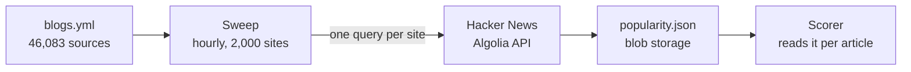
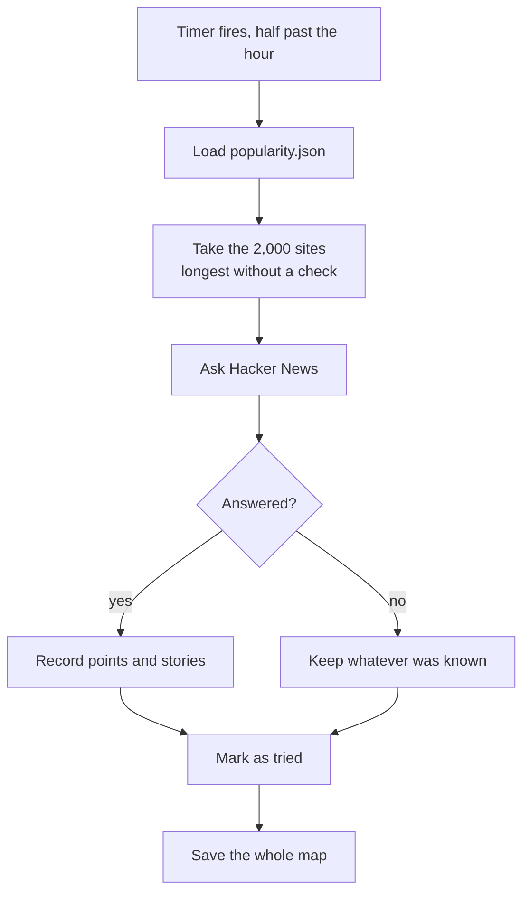
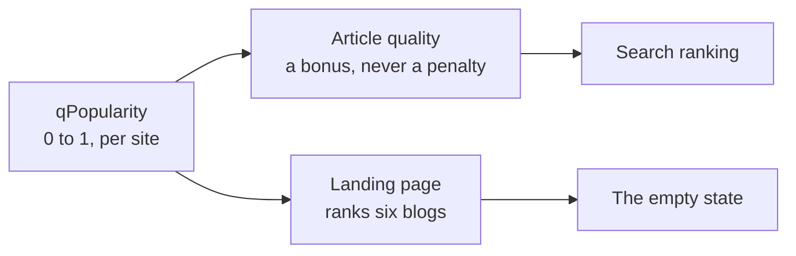

# Popularity

> Where the one figure in this system that no article can supply about itself comes
> from, how a points total becomes a number between 0 and 1, and the two places that
> number is read. Companion to [quality-scoring.md](quality-scoring.md), which owns the
> score popularity feeds into, and to the
> [landing page plan](plans/popular-blogs-landing-plan.md), which owns the list it ranks.

## What popularity means here

Everything else the scorer knows, it reads off the article: how long it is, what
language it is in, whether it is a landing page. Whether anyone found it worth passing
on is the one thing the text cannot say.

**It is not measured from readers of this site.** There are none to measure. blogme sets
no cookie, runs no analytics and counts no clicks, so any answer has to come from
outside. That constraint is the whole reason the design looks the way it does.

Two questions it deliberately does not answer:

| Not this | Why |
| --- | --- |
| How much traffic a blog gets | No free source has it, and the paid estimates are per domain and unreliable at this size |
| Whether a particular article is good | This is a property of the site, asked once per site rather than once per article |

## Where the number comes from

Hacker News, through the [Algolia search API](https://hn.algolia.com/api): free,
unauthenticated, and where this corpus's readers actually circulate.

It is asked **per site, not per article**. That is what makes it affordable: 46,000
lookups instead of 1.4 million, and a site's standing does not change between two of its
posts anyway.



Answers are matched on the **exact host**. Thousands of sources here are subdomains of a
handful of blogging platforms, and a loose match would hand every blog on `bearblog.dev`
the standing of the most popular one on it. The same key, `siteOf`, is used everywhere
popularity is read or written.

### One pass of the sweep

The sweep has no queue. Sites are ordered by how long ago they were last asked about,
never-asked first, and a pass takes the head of that ordering.



**A failed lookup is not an answer.** This is the part worth understanding, because
getting it wrong is invisible. A site that cannot be reached keeps the figures it already
had. Writing zeroes instead would record "nobody has ever posted this site", which is
exactly how the score reads it, and because the entry is marked as tried in the same
breath, that verdict would stand until the site came round again a full rotation later.

Marking it as tried either way is deliberate too: a site left unmarked holds the head of
the ordering and starves everything behind it.

Both outcomes are counted and reported on the pass line, because the map itself cannot
tell them apart:

```text
quality pass complete  scored=4932  sites_swept=722  sites_failed=1278  version=1
```

## From points to a score

A site's raw total is the sum of the points its stories earned, read from the first 50
stories the API returns. That becomes a figure in `[0, 1]`:

```text
qPopularity = min(1, log(1 + points) / log(1 + 500))
```

Logarithmic, because the distance between 0 and 200 points says far more than the
distance between 800 and 1,000. The ceiling of 500 is the total at which a site counts as
fully established.

| Points | Score | Reading |
| ---: | ---: | --- |
| 0 | 0.00 | Never posted, or never successfully read |
| 1 | 0.11 | Posted once, sank |
| 10 | 0.39 | Posted a few times |
| 50 | 0.63 | Known to the audience |
| 200 | 0.85 | Regularly shared |
| 500 or more | 1.00 | Established, and no longer distinguished |

Measured across the corpus on 1 September 2026:

| | |
| --- | --- |
| Sites recorded | 44,439 |
| With any presence | 9,384 (21%) |
| Saturated at 1.00 | 1,592 (3.6%) |
| Sites holding half of all points | 202 (0.45% of the corpus) |
| Quartiles among sites with presence | p25 = 3, p50 = 26, p75 = 266, p90 = 1,005 |

## Where the score is read

Two places, and they use it differently.



**In the article score** it can only add:

```text
quality = qContent + (1 - qContent) × 0.25 × qPopularity
```

Written as a share of the distance still to travel rather than as a weighted average,
because an average would cap an article nobody has heard of below one that has been
shared. Most good blogs have never appeared on Hacker News at all, and reading that
absence as a verdict would rank by fame. See
[quality-scoring.md](quality-scoring.md#popularity).

**On the landing page** it orders the six blogs offered before anyone has searched.
That surface applies filters the score itself does not, because points measure news
circulation and the raw top of the corpus is the BBC and TechCrunch. See
[popular-blogs-landing-plan.md](plans/popular-blogs-landing-plan.md).

## What the number is, and is not

Worth stating plainly so nobody has to reverse-engineer it later.

| Property | Consequence |
| --- | --- |
| It is one audience | Hacker News is where this corpus's readers circulate, and it is still one room. A blog widely read elsewhere reads as unknown here |
| It saturates | Above 500 points it stops distinguishing anything, which is 3.6% of the corpus flattened to a single value |
| It is a lifetime total | A blog started in 2024 cannot out-total one started in 2007, so the ordering is stable for years and rewards longevity |
| It is news-shaped | Points measure circulation, so newspapers outrank blogs on it. Anything user-facing has to filter for that |
| Absence is not evidence | Roughly four sites in five have no presence at all, which is why it may only ever add |

### The figure is still converging

The sweep currently reads about 700 of the 2,000 sites it asks about each hour; the rest
fail against a third party and keep what they had. Sampling sites recorded at zero and
re-checking them by hand puts true coverage nearer 53% than the 21% the map presently
shows, so the recorded figure is climbing as successful reads land.

Failures are counted but not yet classified. Naming the cause is what the `sites_failed`
count was added for, and retry or backoff is the decision that follows from it, not
before it.

## Operating it

| Setting | Default | Meaning |
| --- | --- | --- |
| `BLOGME_QUALITY_SCHEDULE` | `0 30 * * * *` | Timer cron. Half past the hour, so scoring and discovery are not writing the same index at once |
| `BLOGME_QUALITY_SWEEP_BATCH` | `2000` | Sites asked about per pass. `0` turns popularity gathering off |
| `BLOGME_POPULARITY_BLOB` | `popularity.json` | Where site standing is kept, in the sources container |

Turning it off leaves every article judged on its own text, which is a valid state rather
than a degraded one: scores already gathered keep being used, they simply stop being
brought up to date.

```bash
infra/kill-switch.sh jobs off score
```

Rebuilding the index from blob storage empties every score, including this one. That is
fine and expected: the figures are derived, and the same loop fills them in again.

## Cost

Nothing recurring beyond the timer it shares with scoring. Hacker News is free, the blob
is a few megabytes read once and written once per pass, and the score occupies one
`Double` on each document in an index whose binding constraint is storage.

## What was considered and left out

Measured against the corpus before being ruled out, so the reasoning survives the next
time someone asks.

| Source | Coverage | Why not |
| --- | --- | --- |
| Feedly subscriber counts | 57% of a sample | The strongest candidate. Measures standing readership rather than circulation, correlates with Hacker News at only 0.36, and would take union coverage to 76%. Uses the web app's own endpoints rather than a documented API, which is the reason it waits |
| Common Crawl host graph | ~100% | Host-level, so it handles shared blogging platforms correctly. The current graph is a 4.7 GB gzip, viable as an occasional offline job rather than anything the Function does |
| Open PageRank | ~100% | Domain-level only, so every blog on `bearblog.dev` would inherit one rank. The exact failure exact-host matching exists to avoid |
| Tranco | 22% of a sample | Domain-level, and the hits skew to the corpus's non-blog noise |
| Wikipedia external links | 10% of a sample | Measures encyclopaedic notability, not readership |
| Ahrefs, Semrush, Similarweb | n/a | Per-domain estimates at £100+ a month, several times this project's entire infrastructure floor |
