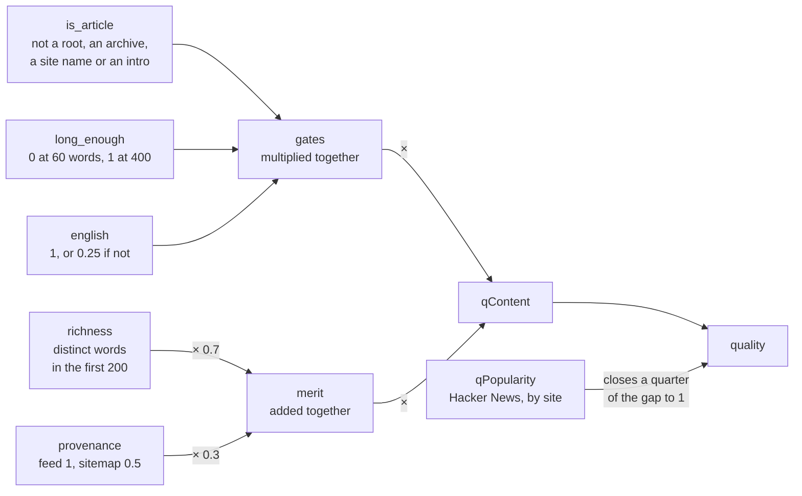
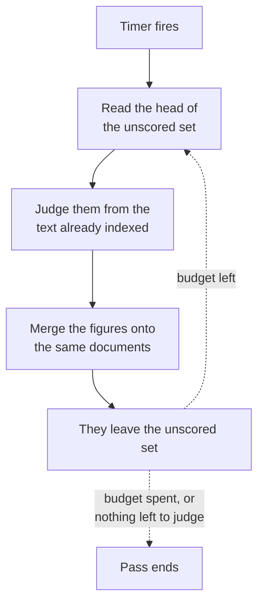
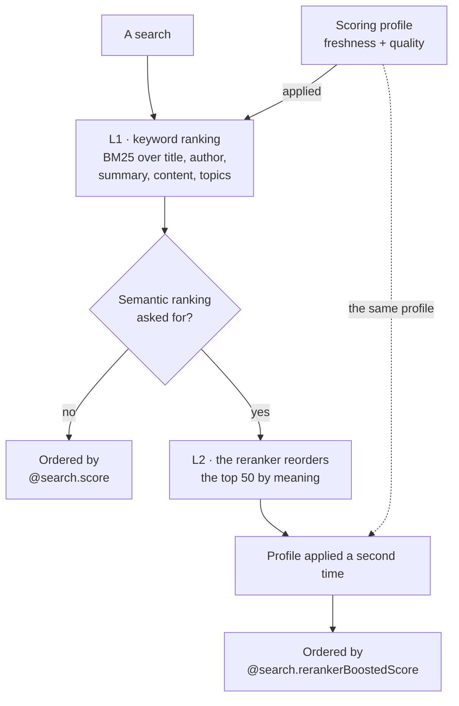

# Quality Scoring

> How an article is judged independently of any query, and how that judgement reaches
> the top of a page of results. Companion to [how-it-works.md](how-it-works.md).

## The problem it solves

Search answers two questions at once: does this document match what was asked for, and
is it worth reading at all. The index answers the first well and the second not at all.

Measured on 24 August 2026, the live top ten for `python` held three documentation
landing pages, three newsletter issue archives and a Portuguese meetup announcement
from 2007. `security` was worse: six of its ten were undated section pages from two
sites. Both queries are single common words, which is where it happens — `rust
ownership` and `github actions` returned ten real articles each, because a query
specific enough to have few matches does not need help.

So the failure is narrow and worth naming precisely: **broad queries, where a short
field stuffed with the query term beats an article about it.**

## What is measured

Once per article, from the text already in the index. Nothing here needs a re-crawl,
an external service, or a language model.



**Gates multiply, merit adds.** The gates are conditions rather than opinions: a
documentation landing page written in flawless English is still a landing page, and no
amount of vocabulary should argue it back up the page. None of them is ever zero,
because each is a heuristic and a heuristic that fires wrongly on a good article should
cost it rank rather than bury it.

| Term          | What it reads                                                                                                                                               | Why                                                                                                                                                  |
| ------------- | ----------------------------------------------------------------------------------------------------------------------------------------------------------- | ---------------------------------------------------------------------------------------------------------------------------------------------------- |
| `is_article`  | URL is a site root or a bare version segment; title is the blog's own name; title is an issue, archive or page number; the text opens by introducing a site | Every landing page in the failing top tens is at least one of these                                                                                  |
| `long_enough` | Under 60 words scores nothing, 400 scores full                                                                                                              | Only the short end counts. The crawler truncates content at 1,000 words, so anything reading length at the top would be measuring the truncation     |
| `english`     | Share of the commonest English words in the first 200                                                                                                       | The index is analysed with an English analyser and the interface is English. Kept at 0.25 rather than 0: this index holds no other copy of that post |
| `richness`    | Distinct words as a share of the first 200                                                                                                                  | Stands in for prose quality. Keyword stuffing, generated filler and navigation boilerplate all say the same few words repeatedly                     |
| `provenance`  | Feed beats sitemap                                                                                                                                          | A feed entry is described by its author. Sitemap walking is what pulled the landing pages in                                                         |
| `qPopularity` | Hacker News points for the site                                                                                                                             | See below                                                                                                                                            |

Measured against the documents that actually failed: real articles score **0.85–1.00**,
landing pages and archives **0.007–0.13**, a post too thin to rank **0.00**.

**The scale is a floor, not a gradient.** Anything plainly an article reaches the top
of it. That is deliberate — the failure being corrected is landing pages outranking
writing, not one good post outranking another, and sorting the good ones among
themselves is what the query is for.

### Popularity

> Summarised here. [popularity.md](popularity.md) is the full account: how the sweep
> gathers it, how a points total becomes a score, what the number is biased towards, and
> the sources measured and rejected.

There is no public source of per-article traffic, and the paid estimates are per-domain
anyway. Hacker News is free, unauthenticated, and where this corpus's readers actually
circulate. It is asked **by site rather than by article**, which turns 600,000 lookups
into 46,000 and makes a full sweep affordable.

It can only ever add:

```text
quality = qContent + (1 - qContent) × 0.25 × qPopularity
```

Most good blogs have never appeared on Hacker News at all, and reading that absence as
a verdict would rank by fame. Written as a share of the distance still to travel rather
than as a weighted average, because an average would cap an article nobody has heard of
below one that has been shared. Here a perfect article scores 1 either way.

Answers are matched on exact host, because thousands of sources here are subdomains of
a handful of blogging platforms and a loose match would hand every blog on
`bearblog.dev` the standing of the most popular one on it.

**A lookup that fails is not an answer.** A site that could not be reached keeps the
figures it already had and is marked as tried, so it goes to the back of the queue
rather than holding the front of it. Writing zeroes instead would record "nobody has
ever posted this site" — which is exactly how the score reads it — and that verdict
would then stand for a full rotation. Every pass reports both numbers, `sites_swept`
and `sites_failed`, because the map itself cannot tell a quiet corpus from a sweep
whose lookups mostly failed.

## How it drains

There is no queue and no cursor. An article leaves the unscored set by being scored, so
the set is its own backlog:



The set is read with one query and no paging:

```text
filter: qualityVersion eq null or qualityVersion lt <version>
orderby: publishedAt desc
top: 1000            ← no skip, so no paging limit to run into
```

The set shrinks by exactly what was done, so a corpus of any size drains in as many
passes as it takes and then costs one query a pass forever after. Newest first, so a
corpus still draining spends its effort where readers are looking.

A run also remembers what it has already handled. A score is accepted before it is
searchable, so without that a pass re-reads the same head while indexing catches up —
judging two articles took nineteen rounds and reported thirty-eight.

Two consequences worth knowing:

- **Rebuilding the index from blob storage empties every score.** That is fine and is
  why scores are not written back to blob: they are derived from indexed text, and the
  same loop simply fills them in again over the following passes.
- **Raising `quality.Version` re-scores everything.** It is the only mechanism for
  that, so a change to the model that does not raise it applies to new articles alone.
  A full popularity sweep finishing is the other reason to raise it.

Scores are written with the `merge` action, never `mergeOrUpload`. An upload would
create a document out of a score alone if the article had since been deleted, and that
document would be returned by searches as a row with no title and no link.

## How it reaches the results

One `magnitude` function on the `quality` field, inside a scoring profile. Azure AI
Search applies a profile twice, which is what stops the reranker from erasing the boost:



The second pass happens because the semantic configuration's `rankingOrder` defaults to
`boostedRerankerScore`. That behaviour is documented against a newer API version than
the one this service pins, so treat the semantic branch as unconfirmed here. The keyword
branch — the one the site asks for by default — is proven end to end.

Nothing in the API sends a profile. The index's `defaultScoringProfile` is what applies,
which means **turning this on is one line of schema and no code at all**.

### The profile ladder

Each profile differs from the one above by a single variable, so a change can be
measured rather than argued about:

| Profile                           | Text weights                                | Functions           |
| --------------------------------- | ------------------------------------------- | ------------------- |
| `relevance`                       | title 4, authorText 3, summary 2, content 1 | none                |
| `relevance-fresh`                 | same                                        | freshness           |
| `relevance-quality` **(default)** | same                                        | freshness + quality |
| `relevance-authorlight`           | authorText dropped to 1                     | freshness + quality |

The weights name `authorText` rather than `author`, and no longer name `topics`, because
those are the fields a query is actually matched against — see `searchFields` in
[index.go](../api/internal/index/index.go). A weight on a field outside that set is never
applied, which `TestScoringProfilesWeightOnlyTheFieldsSearched` now fails over.

### The author weight is doing useful work — leave it at 3

It is easy to conclude otherwise, and this section exists because an earlier pass did.

`author` holds the _blog's_ name, not a person's. It is weighted 3 on a two- or
three-word field, and BM25 normalises by field length, so a blog named after the query
term scores enormously on it. Count how much of a top ten is a blog named after the query
and the weight is plainly the cause — 5% at weight 0.1 against 51% at weight 3, across 30
single-word queries.

**That count is not a measure of harm, and optimising it makes search worse.** The author
field is what holds back documents whose entire title is the query word. Measured over a
ten-point weight grid, 142 queries and 1,300 result pages:

| authorText weight                 | 0.1 | 1   | **3 (shipped)** |
| --------------------------------- | --- | --- | --------------- |
| top-10 that are blogs named so    | 5%  | 35% | 51%             |
| top-10 whose title is ≤ 2 words   | 48% | 39% | **30%**         |
| top-10 titled _exactly_ the query | 21% | 15% | **7%**          |

The two move in opposite directions. At weight 0.1 a search for `python` returns four
posts titled "Python" and nothing else; at weight 3 it returns Planet Python, the Python
documentation and Talk Python Training. Common-word personal names break at low weight for
the same reason — `David Stark` returns "Celebrating St David's Day" and "Robert Stark
Central to FBI Probe", because the author field is the only thing that disambiguates a
name made of ordinary words.

Two structural facts make this trade sharper than it looks. Matching is decided by field
_membership_, not weight: `authorText` being in `searchFields` is what makes an author's
posts match at all, and author recall is 100% at every weight tested and 57% when the
field is removed. And the weight was masked until 2026-08-30, when `titleSuggest` was
found inside the searched set scoring every title twice; removing it restored the stated
weights.

`relevance-authorlight` was built to settle this and has now settled it: the answer is
that dropping the weight is worse. It is kept as the evidence, not as a candidate.

### What did help: the quality boost, made the default 2026-08-30

Stub posts are the real defect behind a poor single-word page, and the quality score is
the lever built for them. Switching the default from `relevance-fresh` to
`relevance-quality`, over the same query sets:

| Measure over single-word queries | `relevance-fresh` | `relevance-quality` |
| -------------------------------- | ----------------- | ------------------- |
| top-10 whose title is ≤ 2 words  | 18%               | **12%**             |
| median words in a result         | 640               | **1,000**           |
| personal-name search, top-1      | 12/20             | **14/20**           |
| personal-name search, top-3      | 17/20             | **19/20**           |

Multi-word, stopword-heavy and rare queries are neutral to slightly better. Author queries
look worse on a naive count — 80% to 71% top-1 — but every one of the nine that changed is
a job board or a careers page being demoted: `Scale AI` under the old default returned
"Engagement Manager | Careers", and under the new one returns articles. On real personal
names the profile is strictly better.

The order-of-operations warning below no longer bites: the corpus is 90% scored, and no
unscored document appeared in any measured top ten under either profile.

Switching profile is one edit to `defaultScoringProfile` in
[search-index.json](../infra/search-index.json) and a re-run of
[create-search-index.sh](../infra/create-search-index.sh). No redeploy, no reindex,
and reverting is the same edit backwards.

> **Order of operations,** which is what the wait before switching was for. A scoring
> function cannot read a null field, so an article with no score gets no boost: turning
> the profile on mid-drain relatively demotes everything not yet reached. Raising
> `quality.Version` puts the corpus back in that state, so the same wait applies again.

## Measuring it

```bash
make harness
```

Runs a fixed set of queries against the real index and prints how they rank: the ones
most searched, the ones used to tune ranking before, and the three that showed landing
pages winning. `PROFILE=relevance-quality` runs the same queries through a different
profile, and `MODE=semantic` through the reranker. Compare two runs by their output.

It is a Go test because that is the one way to run code against the index package
without adding a second `main` to the module, which the Functions host builds. Without
an endpoint it skips, so CI never runs it.

## Operating it

| Setting                      | Default           | Meaning                                                                                         |
| ---------------------------- | ----------------- | ----------------------------------------------------------------------------------------------- |
| `BLOGME_QUALITY_SCHEDULE`    | `0 30 * * * *`    | Timer cron. Half past the hour, so scoring and discovery are not writing the same index at once |
| `BLOGME_QUALITY_SCORE_BATCH` | `5000`            | Articles judged per pass                                                                        |
| `BLOGME_QUALITY_SWEEP_BATCH` | `2000`            | Sites asked about per pass. `0` turns popularity off                                            |
| `BLOGME_POPULARITY_BLOB`     | `popularity.json` | Where site standing is kept, in the sources container                                           |

`BLOGME_QUALITY_SCORE_BATCH` is deployed at **20,000** rather than its default; the rest
run on the defaults above. Against the 1.3M documents indexed as of 30 August, an hourly
pass at 20,000 works through the corpus in about **2.7 days**, where the 5,000 default
would take eleven — long enough that a scoring change would reach most of the index only
after the next one had started. The deployed value is set by
[provision.sh](../infra/provision.sh), which is where to change it: a value edited only in
the portal is one the next provision run will undo.

```bash
infra/kill-switch.sh jobs off score
```

Stops the scoring timer without touching discovery or the site. Search keeps using the
scores already written; they simply stop being brought up to date. The stronger revert is
to move `defaultScoringProfile` back to `relevance-fresh`, which leaves the figures in
place and stops them affecting order at all.

## Cost

Five numeric fields cost about 32 bytes a document — some 40 MB across the 1.3M
documents indexed by 30 August, against an index of roughly 8 GB. The extra hourly timer
is around **11% of the app's compute**, or $1–2 a month of Flex Consumption against
discovery's ~$15. Hacker News and the blob the popularity map lives in are free. There
is no one-off spend and no new service.

## What was deliberately left out

- **A language model grading each article.** It would add what heuristics cannot reach —
  machine-written filler, marketing intent, per-article topics — at roughly $300 to
  judge the corpus once and $15–75 a month to keep up. Every failure actually observed
  is caught by the free signals above, so this waits for evidence that they were not
  enough.
- **Near-duplicate detection.** Two documentation pages with the same title did land on
  one live page, but the same landing-page penalties that demote them individually
  already remove them, and suppressing rows by title would hide the many blogs that
  honestly publish "Weekly update" every week.
- **A source-level prior.** It exists to cover articles a budget would never reach.
  Scoring everything on a timer makes cold start a few passes at most.
- **`kind` as a signal.** Company blogs skew promotional, but the engineering blogs in
  that category are among the best writing in the corpus.
