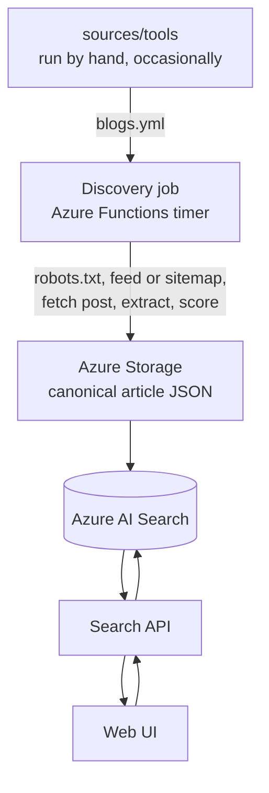
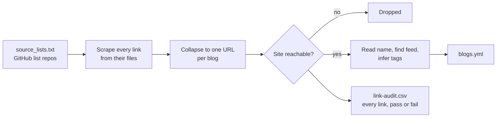

# Sources

The list of blogs blogme is allowed to crawl, and the tool that builds it.

| Path | Contents |
| --- | --- |
| [`blogs.yml`](blogs.yml) | The approved source list, read by the discovery job |
| [`tools/`](tools/README.md) | The extractor that generates `blogs.yml` |
| [`tools/tags.yml`](tools/tags.yml) | The tag vocabulary, edit this to change tagging |

The list is kept in Git so every change goes through normal review, rather than being
edited through an admin service.

## Where this fits

This folder decides **which blogs are allowed in**. It is not the article crawler: that
is the discovery job, which runs continuously and reads `blogs.yml` as its allowlist.



| Stage | What it fetches | How often |
| --- | --- | --- |
| Source extractor | One homepage and feed per candidate, to decide whether a blog is real | Manually, occasionally |
| Discovery job | Each approved blog's feed or sitemap, then every new post | On a timer |
| Search API | Nothing; it queries the index | Per user query |

Keeping the boundary here is deliberate. The [high-level plan](../docs/blog-discovery-search-high-level-plan.md)
calls for discovery to be selective rather than exhaustive, so the crawler only ever
visits sites that passed through this list and a human review. See
[system design](../docs/system-design.md) for the services involved.

The `feed` field is what the discovery job consumes directly. Sources without one need a
sitemap fallback, which is currently a large minority of the list.

## The list

```yaml
sources:
  - id: seangoedecke
    name: Sean Goedecke
    site: https://www.seangoedecke.com/
    feed: https://www.seangoedecke.com/rss.xml
    tags: [software-engineering, ai, tech]
```

| Field | Required | Meaning |
| --- | --- | --- |
| `id` | yes | Stable identifier, used in article IDs and logs |
| `name` | yes | Human-readable title |
| `site` | yes | Homepage |
| `feed` | no | RSS/Atom feed, when the site publishes one |
| `tags` | no | Subject tags, lowercase kebab-case |

Entries can be added or corrected by hand. Keep `id` values stable: changing one changes
the IDs of every article already discovered from that blog.

## How the build works

The build turns a handful of GitHub "awesome blog list" repositories into one validated
list of blogs.



1. **Seeds.** [`tools/source_lists.txt`](tools/source_lists.txt) names the GitHub
   repositories and topics that curate blogs.
2. **Harvest.** Every text file in those repositories is read and every `http(s)` link
   pulled out, roughly 49,000 of them.
3. **Collapse.** Each link becomes the blog it belongs to, so fifty article URLs from one
   site produce one entry. Code hosts, social networks, badges, shorteners and asset
   subdomains are discarded here.
4. **Check.** Each remaining site is requested once. If it does not answer, it is out.
   Reachability is the only membership rule.
5. **Describe.** Survivors get a name from their feed title, `og:site_name` or `<title>`,
   an RSS/Atom feed if one can be found, and subject tags scored against the vocabulary.
6. **Write.** `blogs.yml` is validated and written, alongside `link-audit.csv` recording
   every link that was checked, including failures and the reason.

A feed is recorded when a site has one but is not required, so blogs without feeds still
appear in the list.

## Tags

Subject tags live in [`tools/tags.yml`](tools/tags.yml): one tag per entry, listing the
words that imply it. A tag is kept when it scores at least 2 points.

| Signal | Points |
| --- | --- |
| The blog files posts under that word (a feed category) | 2 |
| Each distinct keyword found in the blog's own text | 1 |

So a single passing mention never earns a tag, while a category the author chose always
does. Blogs that say too little about themselves fall back to the coarse subject their
source list implies, usually `tech`. Tags like `personal-blogs` come from the list a blog
was found in, because a page rarely states that itself.

Adding or retiring a tag means editing `tags.yml` and nothing else.

## Rebuilding

```bash
make sources
```

The full run checks tens of thousands of links and takes a couple of hours. Review the
diff before committing; the audit CSV explains anything that went missing. See
[`tools/README.md`](tools/README.md) for flags, layout and shorter trial runs.
