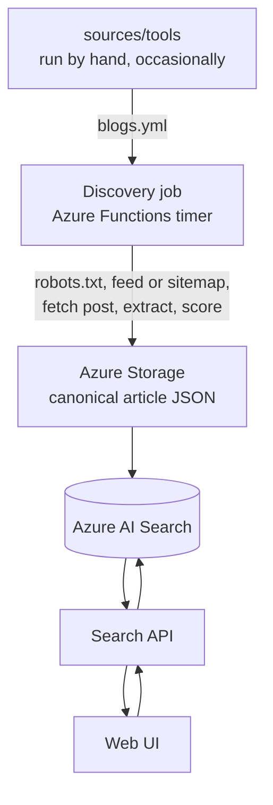
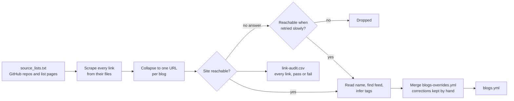
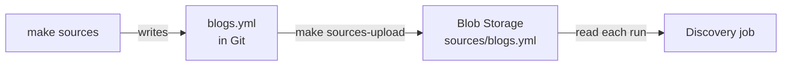

# Sources

The list of blogs blogme is allowed to crawl, and the tool that builds it.

| Path                                         | Contents                                            |
| -------------------------------------------- | --------------------------------------------------- |
| [`blogs.yml`](blogs.yml)                     | The approved source list, read by the discovery job |
| [`blogs-overrides.yml`](blogs-overrides.yml) | Corrections kept by hand, re-applied on every build |
| [`tools/`](tools/README.md)                  | The extractor that generates `blogs.yml`            |
| [`tools/tags.yml`](tools/tags.yml)           | The tag vocabulary, edit this to change tagging     |

The list is kept in Git so every change goes through normal review, rather than being
edited through an admin service.

## Where this fits

This folder decides **which blogs are allowed in**. It is not the article crawler: that
is the discovery job, which runs continuously and reads `blogs.yml` as its allowlist.



| Stage            | What it fetches                                                       | How often              |
| ---------------- | --------------------------------------------------------------------- | ---------------------- |
| Source extractor | One homepage and feed per candidate, to decide whether a blog is real | Manually, occasionally |
| Discovery job    | Each approved blog's feed or sitemap, then every new post             | On a timer             |
| Search API       | Nothing; it queries the index                                         | Per user query         |

Keeping the boundary here is deliberate. The [high-level plan](../docs/plans/blog-discovery-search-high-level-plan.md)
calls for discovery to be selective rather than exhaustive, so the crawler only ever
visits sites that passed through this list and a human review. See
[system design](../docs/system-design.md) for the services involved.

The `feed` field is what the discovery job consumes directly. Sources without one fall
back to a sitemap walk, which is slower and less accurate: 38,403 of 46,083 entries
carry a feed, measured on 30 August 2026.

## The list

```yaml
sources:
  - id: seangoedecke
    name: Sean Goedecke
    site: https://www.seangoedecke.com/
    feed: https://www.seangoedecke.com/rss.xml
    kind: [personal-blogs]
    tags: [software-engineering, ai, tech]
```

| Field  | Required | Meaning                                         |
| ------ | -------- | ----------------------------------------------- |
| `id`   | yes      | Stable identifier, used in article IDs and logs |
| `name` | yes      | Human-readable title                            |
| `site` | yes      | Homepage                                        |
| `feed` | no       | RSS/Atom feed, when the site publishes one      |
| `kind` | no       | What sort of blog it is, e.g. `personal-blogs`  |
| `tags` | no       | Subject tags, lowercase kebab-case              |

`kind` and `tags` are kept apart because they answer different questions. Nearly every
blog on a personal-blog list is a personal blog, so as a subject tag it distinguishes
nothing and crowds out the tags that do; as a kind it is exactly what you would want to
filter by.

Keep `id` values stable: changing one changes the IDs of every article already
discovered from that blog. A rebuild preserves the `id` of every site already in the
file, so only genuinely new sites are assigned one.

## Corrections by hand

`blogs.yml` is generated from nothing on every build, so an edit made there lasts until
the next one. Put it in [`blogs-overrides.yml`](blogs-overrides.yml) instead and it is
re-applied every time.

This is not a theoretical convenience. A blog added by hand with a working feed came
back from a rebuild without one, which moved it to the sitemap path — and since it
publishes no sitemap, it stopped being crawled at all while still looking present in
the list.

```yaml
sources:
  - site: https://www.seangoedecke.com/
    name: Sean Goedecke
    feed: https://www.seangoedecke.com/rss.xml
    tags: [software-engineering, ai, tech]
```

Entries are matched to a generated source by `site`, which must be exactly the `site`
`blogs.yml` carries. Naming a field replaces it; omitting one keeps whatever the build
found. The fields are the same as above, and anything else fails the build rather than
being ignored.

An entry carrying a `name` and `tags` can also stand alone, and is **added** when the
build did not find that site at all — which is how a blog the extractor keeps missing
gets pinned in. An entry without them can only patch, so one that matches nothing is
reported rather than quietly becoming a new and largely empty source.

Applying a correction does not need a rebuild:

```bash
make sources-patch
```

That loads `blogs.yml`, merges this file into it and writes it back: seconds, and a diff
of exactly the sources the corrections touch. A rebuild performs the same merge at the
end of its run, so the two always agree.

`make check` verifies they do, and fails when a correction has been written down but not
delivered — which is not hypothetical either. Four names corrected on 1 September 2026
went a day unapplied, so the front page went on offering a blog called "Essays" while the
file that renamed it sat committed one directory away.

Keep the file short. Every entry in it is one the checks no longer run.

## How the build works

The build turns a handful of curated blog lists into one validated list of blogs.



1. **Seeds.** [`tools/source_lists.txt`](tools/source_lists.txt) names the lists that
   curate blogs: GitHub repositories and topics, and web pages, OPML subscription lists
   or structured files that link to blogs. Adding a list is one line; see
   [`tools/README.md`](tools/README.md#adding-a-source-list) for which form to use.
2. **Harvest.** Every text file in those repositories, and every seed page, is read and
   every `http(s)` link pulled out. On an HTML list the link text is kept as a fallback
   name.
3. **Collapse.** Each link becomes the blog it belongs to, so fifty article URLs from one
   site produce one entry, leaving about 62,000 candidates. Code hosts, social networks,
   badges, shorteners and asset subdomains are discarded here.
4. **Check.** Each remaining site is requested once. If it answers, it is in; a 404 or a
   403 settles the question and it is out. Reachability is the only membership rule.
   This is the long part of the build and runs across several processes, because it is
   bound by parsing the answers rather than by waiting for them.
5. **Retry.** A site that gave no answer at all is asked again, slowly. At full
   concurrency a connect timeout describes the run as much as the site, and a sample of
   the links dropped that way found roughly three quarters of them alive.
6. **Describe.** Survivors get a name from their feed title, `og:site_name` or `<title>`,
   an RSS/Atom feed if one can be found, and subject tags scored against the vocabulary.
   A title belonging to a bot check or a redirect stub rather than to the blog is
   refused, so the site falls back to its domain instead of being called
   "One moment, please..."; the site's name is unknown either way, but only one of
   those is written into every article's author.
   A feed the last build recorded is re-checked and kept unless it is definitely gone;
   a feed lookup that merely timed out no longer erases one.
7. **Override.** [`blogs-overrides.yml`](blogs-overrides.yml) is merged in, so a
   correction made by hand survives the rebuild that would otherwise discard it.
8. **Write.** `blogs.yml` is validated and written, alongside `link-audit.csv` recording
   every link that was checked, including failures and the reason.

A feed is recorded when a site has one but is not required, so blogs without feeds still
appear in the list.

## Tags

Subject tags live in [`tools/tags.yml`](tools/tags.yml): one tag per entry, listing the
words that imply it. A tag is kept when it scores at least 2 points.

| Signal                                                 | Points |
| ------------------------------------------------------ | ------ |
| The blog files posts under that word (a feed category) | 2      |
| Each distinct keyword found in the blog's own text     | 1      |

So a single passing mention never earns a tag, while a category the author chose always
does. Blogs that say too little about themselves fall back to the coarse subject their
source list implies, usually `tech`.

These tags describe the blog, not any one post, so the discovery job treats them as the
starting point rather than the answer: a post is also labelled with the categories its
own feed entry carries. See [how it works](../docs/how-it-works.md).

Adding or retiring a tag means editing `tags.yml` and nothing else.

## Rebuilding

```bash
make sources
```

The full run checks tens of thousands of links, then retries the ones that did not answer,
and takes a few hours. Review the diff before committing; the audit CSV explains anything
that went missing. See [`tools/README.md`](tools/README.md) for flags, layout and shorter
trial runs.

A rebuild is the expensive way to change this list, and it answers only one question:
whether there are blogs the seed lists name that this file does not have. To apply a
correction, use [`make sources-patch`](#corrections-by-hand) instead. See
[keeping the curated lists current](../docs/plans/keeping-the-curated-lists-current.md)
for why a rebuild should not run on a schedule, and what should run instead.

## Publishing

Generating the list does not put it in front of the discovery job. The job reads
`blogs.yml` from blob storage, so a rebuilt list has to be published:

```bash
make sources-upload
```



Publishing is deliberately separate from deploying. The list changes far more often than
the code does, so uploading it is all that is needed — **no rebuild and no redeploy**, and
the running job picks the new list up on its next pass.

Two consequences worth knowing:

- **Locally, nothing is published.** `make dev` reads `blogs.yml` straight off disk via
  `BLOGME_SOURCES_PATH`, so the development loop needs no storage account at all.
- **The job does not re-read the file every run.** It compares the blob's ETag first and
  only downloads and parses again when the list has actually changed, which matters at
  this file's size.

The job also works through the list in slices of a thousand sources per run, recording
the last source it handled, rather than attempting the whole list in one pass. See
[discovery cadence](../docs/discovery-cadence.md).
